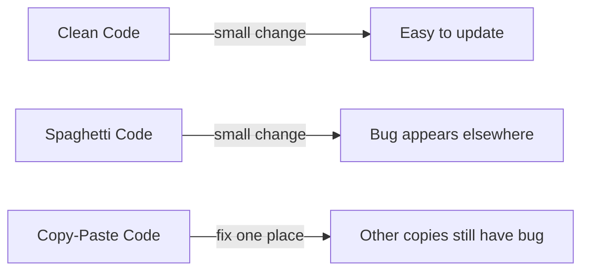

## 1. Definition

### Simple Definition
An anti‑pattern is a **common bad solution** that looks helpful at first but actually creates more problems. It’s a mistake that developers keep repeating.

### One‑Line Exam Definition
*“A common but flawed solution to a recurring problem that leads to negative consequences.”*

---

## 2. Why Do We Need to Know Anti‑patterns?

### What Problem They Solve (by knowing them)
Recognising anti‑patterns helps you **avoid known traps**. If you know what bad code looks like, you can write better code.

### Why Were They Created?
Experienced developers noticed the same bad solutions appearing again and again. They documented them so beginners could learn from others’ mistakes.

### What Happens Without This Knowledge?
You might accidentally write **spaghetti code**, copy‑paste everywhere, or hardcode values – then spend weeks fixing bugs and struggling to add features.

---

## 3. Real‑World Analogy

**Building a house on a weak foundation** – it looks fine at first, but cracks appear later. Fixing it costs more than building correctly from the start. Anti‑patterns are the “weak foundations” of software.

---

## 4. When to Look for Anti‑patterns

- During **code reviews** – check if anyone is using a known anti‑pattern.
- When **debugging** – many bugs come from anti‑patterns.
- When **refactoring** – replace anti‑patterns with good solutions.
- In **exams** – you may be asked to identify or fix an anti‑pattern.

---

## 5. Key Terms

| Term | Meaning |
|------|---------|
| **Spaghetti Code** | Code with no clear structure – jumps everywhere, hard to follow. |
| **Copy‑Paste Programming** | Repeating the same code block instead of reusing a function. |
| **Hardcoding** | Writing fixed values (like file paths) directly in code instead of using configuration. |
| **DRY** | “Don’t Repeat Yourself” – a principle that says avoid duplication. |
| **Golden Hammer** | Using the same tool/pattern for every problem, even when it doesn’t fit. |

---

## 6. Three Common Anti‑patterns (Exam Focus)

| Anti‑pattern | What It Looks Like | Why It’s Bad |
|--------------|--------------------|---------------|
| **Spaghetti Code** | Code with many `goto` statements, unclear flow, no separation of concerns | Hard to read, test, fix, or change. |
| **Copy‑Paste Programming** | Same 5 lines of validation copied in 10 places | If you fix one copy, you must fix all 10 – bug magnet. |
| **Hardcoding** | `String path = "C:\\temp\\data.txt"` instead of reading from a config file | To change the path, you must recompile the code. |

---

## 7. Diagram – How Anti‑patterns Make Code Worse



---

## 8. How to Avoid Anti‑patterns (Simple Steps)

1. **Follow design principles** – DRY, KISS (Keep It Simple), single responsibility.
2. **Refactor early** – when you see duplication, extract a method.
3. **Use configuration files** – never hardcode values that may change.
4. **Do code reviews** – four eyes see more anti‑patterns.
5. **Learn from mistakes** – study common anti‑patterns so you recognise them.

---

## 9. Simple Example – Copy‑Paste Anti‑pattern

### Bad (Anti‑pattern)
```java
// In LoginService
if (user.getAge() < 18) {
    throw new IllegalArgumentException("Too young");
}

// In RegistrationService – same code again!
if (user.getAge() < 18) {
    throw new IllegalArgumentException("Too young");
}
```

### Good (Fixed)
```java
// Create a reusable method
public void validateAge(User user) {
    if (user.getAge() < 18) {
        throw new IllegalArgumentException("Too young");
    }
}

// Call it everywhere
validateAge(user);
```

---

## 10. Real Software Examples

| System | Anti‑pattern Seen |
|--------|-------------------|
| **Legacy banking systems** | Spaghetti COBOL code – no one can safely change it. |
| **Big Excel “applications”** | Copy‑paste formulas across thousands of cells. |
| **Early WordPress plugins** | Hardcoded database credentials inside PHP files. |
| **Rushed startup MVP** | Golden Hammer – using a heavy framework for a simple static page. |

---

## 11. Advantages of Knowing Anti‑patterns

| Advantage | Why It Helps |
|-----------|---------------|
| **Avoid mistakes** | You recognise traps before falling into them. |
| **Improve code quality** | You replace bad solutions with good patterns. |
| **Faster debugging** | You know where bugs usually hide. |
| **Better interviews** | Many interview questions ask you to spot anti‑patterns. |

---

## 12. Disadvantages (of Anti‑patterns themselves, not knowing them)

| Disadvantage | Why It’s Bad |
|--------------|---------------|
| **Increase technical debt** | Fixing later costs much more. |
| **Reduce readability** | New developers cannot understand the code. |
| **Make testing hard** | Spaghetti code cannot be unit tested easily. |
| **Slow down development** | Every change takes longer because of side effects. |

---

## 13. How to Identify in Exams

### Exam Keywords

| Keyword | Why It Points to Anti‑pattern |
|---------|-------------------------------|
| “Copy‑paste code” | Directly indicates copy‑paste programming. |
| “No clear structure” | Spaghetti code. |
| “Values written directly in code” | Hardcoding. |
| “Repeating code blocks” | Violation of DRY → copy‑paste. |
| “Common mistake” / “Bad practice” | Anti‑pattern definition. |

---

## 14. Comparison – Pattern vs Anti‑pattern

| Aspect | Design Pattern | Anti‑pattern |
|--------|----------------|---------------|
| **Result** | Good solution | Bad solution |
| **Effect** | Improves code | Creates problems |
| **Example** | Singleton, Factory | Spaghetti code, hardcoding |
| **When to use** | Always when problem fits | Never – avoid or fix |

---

## 15. Viva Questions

| # | Question | Answer |
|---|----------|--------|
| 1 | What is an anti‑pattern? | A common bad solution that looks helpful but causes problems. |
| 2 | Name three anti‑patterns. | Spaghetti code, copy‑paste programming, hardcoding. |
| 3 | Why is copy‑paste programming bad? | It duplicates code; fixing one copy leaves others buggy. |
| 4 | What does DRY stand for? | Don’t Repeat Yourself. |
| 5 | How do you fix hardcoding? | Move the value to a configuration file or constant. |
| 6 | Give an example of spaghetti code. | Code with many `goto` statements or deeply nested if‑else. |
| 7 | Can a design pattern become an anti‑pattern? | Yes – overusing a pattern (e.g., Singleton everywhere) is an anti‑pattern. |
| 8 | What is the “Golden Hammer” anti‑pattern? | Using the same tool for every problem, even when unsuitable. |
| 9 | How can code reviews help with anti‑patterns? | Another person spots duplication or hardcoding that you missed. |
| 10 | Is all code duplication bad? | Not always – but avoid accidental duplication of logic. |

---

## 16. Memory Tip

**“SCH” – Spaghetti, Copy‑paste, Hardcoding** – three anti‑patterns to remember.

Or **“Don’t Copy Hard Spaghetti”** – Don’t (avoid) Copy‑paste, Hardcoding, Spaghetti.

---

## 17. Quick Revision

### Category
Software Design / Code Smells

### Problem
Developers repeat the same bad solutions (spaghetti code, copy‑paste, hardcoding), leading to unmaintainable bug‑prone software.

### Solution
Learn anti‑patterns so you can recognise and avoid them. Replace them with clean, DRY, configurable code.

### Key Components
- Spaghetti code – no structure
- Copy‑paste – code duplication
- Hardcoding – fixed values in code

### Advantages of knowing them
Avoid mistakes, improve code quality, faster debugging.

### Keywords
Anti‑pattern, spaghetti, copy‑paste, hardcoding, DRY, code smell, technical debt.

### One‑Line Exam Definition
*“A documented common bad solution to a recurring problem.”*

### One‑Line Summary
**Anti‑pattern = a mistake developers keep making – learn it to avoid it.**

---

<Callout type="warning">
  **Exam Tip:** When asked to “fix” an anti‑pattern, always propose a concrete replacement:  
  – Spaghetti code → refactor into methods/classes.  
  – Copy‑paste → extract a reusable method.  
  – Hardcoding → use configuration or constants.
</Callout>

