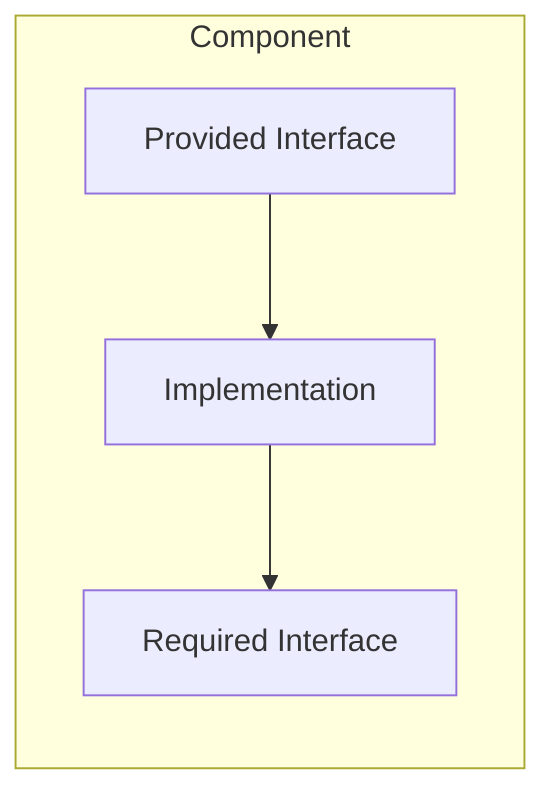

## 1. Definition

### Simple Definition
CBSE builds software by **assembling pre‑built components** (like Lego bricks) instead of writing everything from scratch. “Buy, don’t build.”

### One‑Line Exam Definition
*“Software engineering approach that develops systems by integrating independent, reusable, and deployable components.”*

---

## 2. Why Do We Need It?

### Problem Without CBSE
Traditional development is slow, expensive, and reinvents the same functionality repeatedly.

### Why Was It Created?
To **reduce development time and cost** by reusing existing components. Also to improve reliability (components already tested).

### What Happens Without It?
Longer time‑to‑market, higher costs, lower quality.

---

## 3. Real‑World Analogy

**Building a PC** – you buy pre‑built parts (CPU, RAM, hard drive) and assemble them. You don’t build each chip yourself. Components are independent, replaceable, and reusable.

---

## 4. When to Use CBSE

- Systems with clear interface contracts between parts.
- Applications requiring loose coupling and high reusability.
- When suitable COTS (Commercial Off‑The‑Shelf) components exist.
- Large systems where parallel development is needed.

---

## 5. Key Terms

| Term | Meaning |
|------|---------|
| **Component** | Modular, deployable, replaceable unit with well‑defined interfaces. |
| **COTS** | Commercial Off‑The‑Shelf – ready‑made component you buy. |
| **Port** | Connection point of a component. |
| **Interface** | Public contract of what component provides and requires. |
| **Composability** | Ability to combine components. |
| **Deployable** | Can be installed and run independently. |

---

## 6. Component Characteristics (from slides)

| Characteristic | Meaning |
|----------------|---------|
| **Independent** | Can operate without other components. |
| **Deployable** | Self‑contained, can be installed separately. |
| **Composable** | Communicates only through public interfaces. |
| **Replaceable** | One component can be swapped for another (same interface). |
| **Reusable** | Can be used in different systems. |

---

## 7. Structure / Components

**Ports** = connection points (synchronous, asynchronous, or I/O streams).

---

## 8. CBSE vs Traditional Software Development

| Aspect | CBSE | Traditional (Waterfall) |
|--------|------|--------------------------|
| **Approach** | Assemble from existing components | Build from scratch |
| **Requirements** | Adapted to available components | Requirements fixed first |
| **Time to market** | Shorter | Longer |
| **Cost** | Lower (reuse) | Higher |
| **Reliability** | Higher (tested components) | Depends on new code |

---

## 9. CBSE Lifecycle

1. **Requirements elicitation** – normal process.
2. **Architectural design** – define system structure.
3. **Component identification** – what components are needed?
4. **Component search** – find existing components (COTS or in‑house).
5. **Component adaptation** – adjust if needed (wrappers).
6. **Assembly & integration** – put components together.
7. **Testing** – focus on integration.

**Key difference:** Requirements may be adjusted to match available components (not fixed like waterfall).

---

## 10. Fundamental Principles (from slides)

| Principle | Explanation |
|-----------|-------------|
| **Independent development** | Different people/groups can develop different components. |
| **Reusability** | Design components for reuse, not just one project. |
| **Software quality** | Each component must be verified (testing, reasoning). |

**Trade‑offs:** 
- Dependencies vs Reusability – fewer dependencies = more reusable.
- Performance vs Reusability – general components may be slower than specialised ones.

---

## 11. Component Identification (Case Study from slides)

**Clinic appointment system** – requirements: doctors, patients, appointments, billing.

**Steps:**
1. Create **business concept diagram** (entities: Doctor, Patient, Appointment, Billing).
2. Identify **independent entities** as potential components.
3. Map to **provided and required interfaces**.

**First‑cut component diagram:** (from slides, not drawn here – but concept: each component has well‑defined interfaces).

---

## 12. Advantages of CBSE (from slides)

| Advantage | Why It’s Good |
|-----------|---------------|
| **Reusability** | Components used across multiple projects. |
| **Easier maintenance** | Update one component without affecting others. |
| **Independence** | Different teams work on different components in parallel. |
| **Productivity** | Faster development, reduced time‑to‑market. |
| **Reliability** | Components already tested. |

---

## 13. Disadvantages / Limitations (from slides)

| Disadvantage | Why It’s Bad |
|--------------|---------------|
| **Difficulty finding suitable components** | May not exist for your exact need. |
| **Adaptation issues** | Wrapping or modifying components takes effort. |
| **Few dedicated tools** | Component‑oriented design tools are limited. |
| **Performance overhead** | May be less optimised than custom code. |

---

## 14. How to Identify in Exams

### Exam Keywords

| Keyword | Points to CBSE |
|---------|----------------|
| “Buy, don’t build” | Philosophy. |
| “COTS components” | Commercial off‑the‑shelf. |
| “Deployable, replaceable, reusable” | Component characteristics. |
| “Assembly of components” | Development approach. |
| “Interface contracts” | Key to component composition. |

---

## 15. Viva Questions

| # | Question | Answer |
|---|----------|--------|
| 1 | What is CBSE? | Building software by assembling pre‑built components. |
| 2 | Name three characteristics of a component. | Independent, deployable, reusable. |
| 3 | What does COTS stand for? | Commercial Off‑The‑Shelf. |
| 4 | How does CBSE differ from traditional development? | Assembles rather than builds from scratch. |
| 5 | What is a port in component architecture? | Connection point of a component. |
| 6 | Give one advantage of CBSE. | Reduced time‑to‑market. |
| 7 | Give one disadvantage. | Difficulty finding suitable components. |
| 8 | What is the “performance vs reusability” trade‑off? | General reusable components may be slower than specialised ones. |

---

## 16. Memory Tip

**“Lego bricks for software”** – CBSE = snap together pre‑built pieces.

**“Buy, don’t build”** – remember the philosophy.

---

## 17. Quick Revision

### Category
Architectural Style / Development Paradigm

### Problem
Traditional development is slow, expensive, and reinvents code.

### Solution
Assemble systems from independent, reusable, deployable components.

### Key Components
- Component (with interfaces)
- Ports (connection points)
- COTS components

### Advantages
Reusability, speed, reliability, parallel development.

### Keywords
CBSE, component, COTS, deployable, composable, interface contract.

### One‑Line Exam Definition
*“Software engineering approach that builds systems by integrating independent, reusable components.”*

### One‑Line Summary
**CBSE = Lego brick software – snap, don’t sculpt.**

---

<Callout type="success">
  **Exam Tip:** Compare CBSE with traditional development – CBSE is faster, cheaper, and more reliable, but requires available components and may need adaptation.
</Callout>

