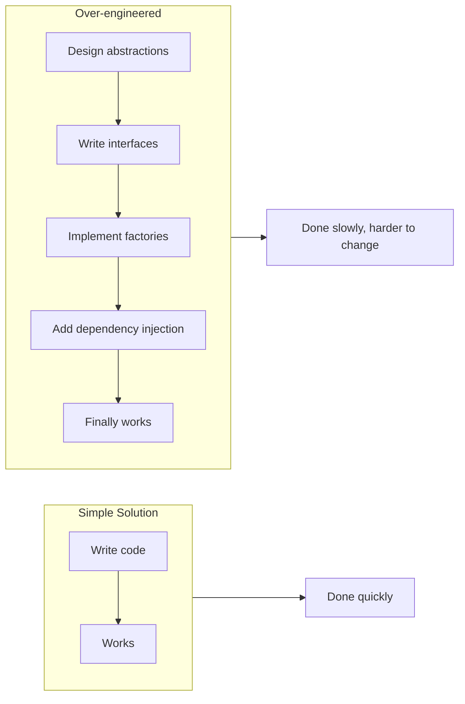

## 1. Definition

### Simple Definition
Over‑engineering means making a system **more complex than it needs to be** – adding features, layers, or abstractions that are not required right now.

### One‑Line Exam Definition
*“Adding unnecessary complexity to a solution, often in anticipation of future needs that never happen.”*

---

## 2. Why Do We Need to Understand Over‑engineering?

### The Problem It Addresses
Many developers try to “future‑proof” their code. They add generic frameworks, complex design patterns, and extra flexibility “just in case”. This wastes time and makes the code harder to understand.

### Why Was This Concept Created?
Experienced developers noticed that **simpler solutions work better** in the long run. Over‑engineering kills productivity and increases bugs.

### What Happens Without This Awareness?
You build a system with 20 classes for a feature that could be written in 5. Then the requirement changes – and you waste hours fixing all those unnecessary abstractions.

---

## 3. Real‑World Analogy

**Buying a racing bicycle to ride 500 metres to the grocery store** – it’s overkill. A simple bicycle (or walking) does the job. Over‑engineering is the racing bike – expensive, heavy, and unnecessary for the actual need.

---

## 4. When to Avoid Over‑engineering

- **Building a prototype** – keep it simple; you will throw it away.
- **Solving a small, well‑understood problem** – don’t add patterns for “maybe later”.
- **When deadlines are tight** – over‑engineering slows delivery.
- **When the requirements are uncertain** – simple code is easier to change later.

---

## 5. Key Terms

| Term | Meaning |
|------|---------|
| **YAGNI** | “You Aren’t Gonna Need It” – principle: don’t add features until they are truly needed. |
| **KISS** | “Keep It Simple, Stupid” – simple solutions are better. |
| **Abstraction** | Hiding complexity – over‑engineering creates too many abstraction layers. |
| **Future‑proofing** | Designing for hypothetical future needs – often leads to over‑engineering. |

---

## 6. Signs of Over‑engineering

| Sign | Example |
|------|---------|
| **Too many layers** | UI → Service → Manager → Coordinator → Adapter → Repository (for a 3‑table database). |
| **Generic when specific is enough** | Writing a generic `SortingFramework<T>` when you only sort one list of integers. |
| **Patterns everywhere** | Using Visitor, Strategy, and Factory for a simple calculator. |
| **Configuration instead of code** | Externalising every single value into XML/JSON, even values that never change. |

---

## 7. Diagram – Over‑engineering vs Simple Solution



---

## 8. How to Avoid Over‑engineering (Simple Steps)

1. **Start simple** – solve the current problem, not every possible problem.
2. **Follow YAGNI** – if you don’t need it today, don’t add it.
3. **Refactor when needed** – add abstractions only when repetition proves they are necessary.
4. **Ask “do I need this now?”** – if answer is “maybe later”, leave it out.
5. **Write the simplest code that works** – then improve only when required.

---

## 9. Simple Example – Over‑engineering

### Over‑engineered (Bad)
```java
// A simple sum function with unnecessary generics and abstraction
public interface Calculator<T extends Number> {
    T sum(T a, T b);
}

public class IntegerCalculator implements Calculator<Integer> {
    @Override
    public Integer sum(Integer a, Integer b) {
        return a + b;
    }
}

// Then a factory to create the calculator...
public class CalculatorFactory {
    public static Calculator<?> getCalculator() {
        return new IntegerCalculator();
    }
}
```

### Simple (Good)
```java
// Just write what you need
public int sum(int a, int b) {
    return a + b;
}
```

---

## 10. Real Software Examples

| System | Over‑engineering Example |
|--------|--------------------------|
| **Startup MVP** | Building a microservices architecture for 100 users → should have used a monolith. |
| **Internal tool** | Adding role‑based access control, audit logs, and REST API when only one person uses it. |
| **Student project** | Using Spring Boot + MongoDB + Docker + Kubernetes for a simple to‑do list app. |
| **Enterprise software** | A configuration framework that can read from 10 different sources – but only one source is ever used. |

---

## 11. Advantages of Avoiding Over‑engineering

| Advantage | Why It Helps |
|-----------|---------------|
| **Faster development** | Less code to write and test. |
| **Easier maintenance** | Simple code is easy to understand. |
| **Fewer bugs** | Fewer moving parts → fewer failures. |
| **Cheaper** | Less time spent on unnecessary features. |

---

## 12. Disadvantages of Over‑engineering

| Disadvantage | Why It’s Bad |
|--------------|---------------|
| **Wastes time** | Building features nobody asked for. |
| **Reduces readability** | New developers cannot follow the abstraction maze. |
| **Increases maintenance cost** | Every change requires updating many files. |
| **Makes testing harder** | Too many dependencies and interfaces. |

---

## 13. How to Identify in Exams

### Exam Keywords

| Keyword | Why It Points to Over‑engineering |
|---------|------------------------------------|
| “Unnecessary complexity” | Direct definition. |
| “Future‑proofing” / “Just in case” | Adding features not needed now. |
| “Too many layers / abstractions” | Over‑engineering sign. |
| “YAGNI” / “KISS” | Principles that oppose over‑engineering. |
| “Pattern overuse” | Using design patterns where a simple function works. |

---

## 14. Comparison – Over‑engineering vs Good Design

| Aspect | Over‑engineering | Good Design |
|--------|------------------|--------------|
| **Complexity** | High, often unnecessary | Only as complex as needed |
| **Extensibility** | Built for every possible future | Built for current needs, refactor later |
| **Code volume** | Large | Small to medium |
| **Readability** | Poor (too many indirections) | Good |
| **Development time** | Long | Short |
| **When to use** | Never | Always |

---

## 15. Viva Questions

| # | Question | Answer |
|---|----------|--------|
| 1 | What is over‑engineering? | Adding unnecessary complexity to a solution. |
| 2 | What does YAGNI stand for? | You Aren’t Gonna Need It. |
| 3 | Give an example of over‑engineering. | Using a full microservices setup for a simple blog. |
| 4 | What is the difference between good abstraction and over‑engineering? | Good abstraction solves a real duplication; over‑engineering adds layers “just in case”. |
| 5 | Name a principle that fights over‑engineering. | KISS (Keep It Simple, Stupid). |
| 6 | Why is over‑engineering harmful? | Wastes time, makes code hard to read and maintain. |
| 7 | How do you avoid over‑engineering? | Start simple, follow YAGNI, add abstractions only when needed. |
| 8 | Can design patterns cause over‑engineering? | Yes – using a complex pattern for a trivial problem. |
| 9 | What is the “golden hammer” anti‑pattern? | Using the same tool/pattern for everything – often leads to over‑engineering. |
| 10 | Is over‑engineering always bad? | Yes – it always adds cost without immediate benefit. |

---

## 16. Memory Tip

**“YAGNI + KISS = no over‑engineering”** – remember these two acronyms.

**Y**ou **A**ren’t **G**onna **N**eed **I**t  
**K**eep **I**t **S**imple, **S**tupid

---

## 17. Quick Revision

### Category
Software Design / Development Practices

### Problem
Developers add unnecessary complexity (layers, patterns, generic code) for features that may never be needed.

### Solution
Follow **YAGNI** and **KISS** – solve today’s problem simply. Add complexity only when the repetition proves it necessary.

### Key Components
- YAGNI principle
- KISS principle
- Unnecessary abstractions
- Over‑use of patterns

### Advantages of avoiding it
Faster development, easier maintenance, fewer bugs, lower cost.

### Disadvantages of over‑engineering
Wasted time, poor readability, high maintenance cost, harder testing.

### Keywords
Over‑engineering, YAGNI, KISS, unnecessary complexity, future‑proofing, simple design.

### One‑Line Exam Definition
*“Adding more complexity, features, or abstractions than currently needed.”*

### One‑Line Summary
**Over‑engineering = solving problems you don’t have yet.**

---

<Callout type="success">
  **Exam Tip:** If asked “how would you improve this over‑engineered code?” – remove unnecessary interfaces, reduce layers, and replace generic code with concrete simple functions. Then mention YAGNI.
</Callout>