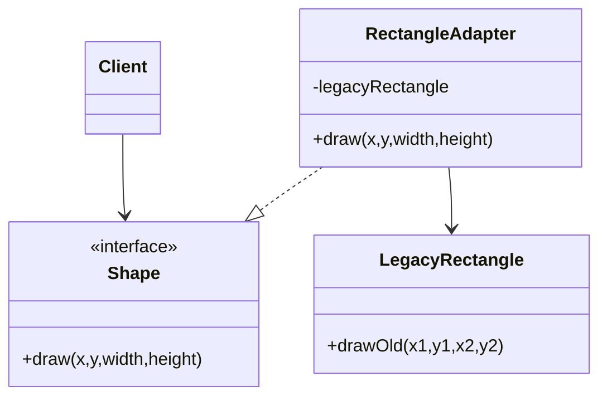
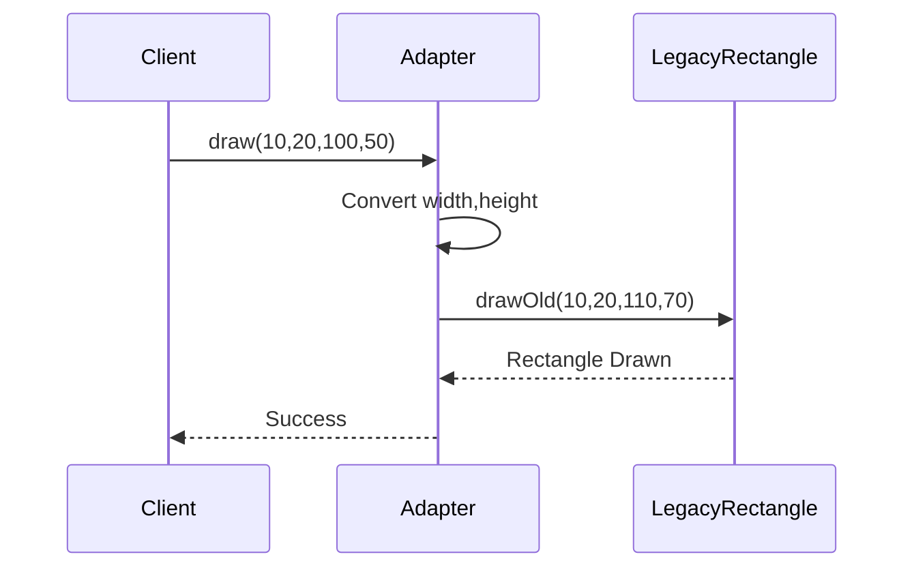

# Adapter Pattern

## Definition

The **Adapter Pattern** is a **Structural Design Pattern** that allows two incompatible interfaces to work together.

It acts as a bridge between an existing class and the interface that a client expects.

Instead of modifying existing code, an adapter wraps the incompatible object and translates requests from one interface to another.

<Callout type="info">
In simple words: An Adapter converts one interface into another interface that the client can understand.
</Callout>
---

## Why Do We Need Adapter Pattern?

During software development, we often face situations where:

- Existing classes are already implemented and tested.
- Third-party libraries provide useful functionality.
- Legacy systems must be integrated into modern applications.
- Different modules use different interfaces.

The problem is that their interfaces do not match.

Without Adapter Pattern:

```text
Client ----X----> Legacy Class
```

The client cannot communicate with the legacy class because both speak different "languages".

The Adapter Pattern solves this by translating requests.

```text
Client ---> Adapter ---> Legacy Class
```

---

## Real-World Analogy

Imagine you have:

- A European charger (2-pin plug)
- A UK wall socket (3-pin socket)

The charger cannot be plugged directly into the socket.

You use a **travel adapter**.

```text
European Charger
        │
        ▼
Travel Adapter
        │
        ▼
UK Socket
```

The adapter converts one format into another.

Similarly, in software:

```text
Client Interface
        │
        ▼
Adapter
        │
        ▼
Legacy Class
```

---

## Problem Scenario

Suppose your application expects all shapes to implement:

```java
interface Shape {
    void draw(int x, int y, int width, int height);
}
```

But you already have an old class:

```java
class LegacyRectangle {
    public void drawOld(int x1, int y1, int x2, int y2) {
        ...
    }
}
```

The methods are different.

| Modern System | Legacy System |
|--------------|--------------|
| draw(x,y,width,height) | drawOld(x1,y1,x2,y2) |

The client cannot directly use `LegacyRectangle`.

This is where Adapter Pattern is required.

---

# Structure of Adapter Pattern

## Participants

### 1. Client

The code that wants to use an object.

```java
shape.draw(...)
```


### 2. Target Interface

The interface expected by the client.

```java
interface Shape {
    void draw(...);
}
```

### 3. Adaptee

Existing class with incompatible interface.

```java
class LegacyRectangle
```

### 4. Adapter

Converts requests from Target Interface to Adaptee Interface.

```java
class RectangleAdapter implements Shape
```

---

## UML Class Diagram



---

## Working Flow



---

# Implementation

## Step 1: Create Target Interface

```java
interface Shape {
    void draw(int x, int y, int width, int height);
}
```

The client only knows this interface.

---

## Step 2: Existing Legacy Class

```java
class LegacyRectangle {

    public void drawOld(
        int x1,
        int y1,
        int x2,
        int y2
    ) {

        System.out.println(
            "Drawing rectangle from (" +
            x1 + "," + y1 +
            ") to (" +
            x2 + "," + y2 + ")"
        );
    }
}
```

---

## Step 3: Create Adapter

```java
class RectangleAdapter implements Shape {

    private LegacyRectangle legacyRect;

    public RectangleAdapter(
        LegacyRectangle legacyRect
    ) {
        this.legacyRect = legacyRect;
    }

    @Override
    public void draw(
        int x,
        int y,
        int width,
        int height
    ) {

        int x2 = x + width;
        int y2 = y + height;

        legacyRect.drawOld(
            x,
            y,
            x2,
            y2
        );
    }
}
```

### What happens here?

The adapter receives:

```java
draw(10,20,100,50)
```

The old system requires:

```java
drawOld(x1,y1,x2,y2)
```

So it converts:

```java
x2 = 10 + 100 = 110
y2 = 20 + 50 = 70
```

Then calls:

```java
drawOld(10,20,110,70)
```

---

## Step 4: Client Code

```java
public class Client {

    public static void main(String[] args) {

        LegacyRectangle oldRect =
                new LegacyRectangle();

        Shape shape =
                new RectangleAdapter(oldRect);

        shape.draw(
            10,
            20,
            100,
            50
        );
    }
}
```

---

## Output

```text
Drawing rectangle from (10,20) to (110,70)
```

---

# How to Identify Adapter Pattern in Exams

Look for keywords such as:

- Existing class
- Legacy system
- Third-party library
- Interface mismatch
- Incompatible interfaces
- Reuse existing code
- Cannot modify source code
- Need integration

Whenever these appear, Adapter Pattern is usually the answer.

---

# Common Real Software Examples

## Example 1: Payment Gateway

Your application uses:

```java
processPayment()
```

But a third-party service provides:

```java
makeTransaction()
```

Adapter converts one into the other.

---

## Example 2: Database Drivers

Application expects:

```java
Database.connect()
```

Different database drivers provide different APIs.

Adapters standardize communication.

---

## Example 3: Mobile Chargers

USB-C phone with old USB port.

Adapter converts interfaces.

---

## Example 4: Legacy Enterprise Systems

A modern web application needs data from a 20-year-old software system.

Instead of changing the old system, create an Adapter.

---

# Advantages

### 1. Reuse Existing Code

No need to rewrite old classes.

### 2. Follows Open/Closed Principle

Existing code remains unchanged.

### 3. Better Maintainability

Changes remain isolated inside adapter.

### 4. Integrates Third-Party Libraries Easily

Allows incompatible libraries to work together.

# Disadvantages

### 1. Extra Complexity

More classes are introduced.

### 2. Additional Layer

Can slightly increase execution overhead.

### 3. Harder Debugging

Calls pass through adapter before reaching adaptee.

---

# Adapter vs Decorator

| Adapter | Decorator |
|----------|-----------|
| Changes interface | Adds behavior |
| Makes incompatible classes compatible | Enhances existing functionality |
| Focuses on compatibility | Focuses on extension |

---

# Adapter vs Facade

| Adapter | Facade |
|----------|---------|
| Converts interface | Simplifies interface |
| Solves compatibility issue | Solves complexity issue |
| One object to another | Many objects to one interface |

---

# Exam/Viva Questions

### Q1: What is Adapter Pattern?

A structural design pattern that converts one interface into another interface expected by the client.

---

### Q2: Why is Adapter Pattern used?

To make incompatible classes work together without modifying existing code.

---

### Q3: Which design pattern category does Adapter belong to?

Structural Design Pattern.

---

### Q4: What are the main participants?

1. Client
2. Target Interface
3. Adapter
4. Adaptee

---

### Q5: What is an Adaptee?

The existing class having an incompatible interface.

---

### Q6: What is the role of Adapter?

It translates requests between the client and the adaptee.

---

### Q7: Give a real-world example.

Travel plug adapter, USB adapter, payment gateway integration.

---

# Quick Revision


### Problem: [step]
Client and existing class have incompatible interfaces.

### Solution: [step]
Create an Adapter.

### Participants: [step]
- Client
- Target Interface
- Adapter
- Adaptee

### Category: [step]
Structural Pattern

### Purpose: [step]
Interface Conversion

### Key Benefit: [step]
Reuse legacy code without modification.


```mermaid
flowchart TD
    Start([Client needs to call Target.request()])
    Client[Client] -->|holds reference to Adapter| AdapterObj[Adapter instance]
    AdapterObj -->|implements Target interface| CallRequest[Call request() on Adapter]
    
    CallRequest --> Translate[Adapter translates request()\nto Adaptee.specificRequest()]
    Translate --> Delegate[Adapter delegates call to Adaptee]
    Delegate --> AdapteeExec[Adaptee executes specificRequest()]
    
    AdapteeExec --> Return[Result returned to Adapter]
    Return --> ClientResult[Client receives result as expected from Target]
    ClientResult --> End([Done])
    
    subgraph Legend [Legend]
        direction LR
        L1[Client] --> L2[Adapter]
        L2 --> L3[Adaptee]
    end
    
    style Client fill:#e1f5fe
    style AdapterObj fill:#c8e6c9
    style AdapteeExec fill:#ffe0b2
    style Translate fill:#fff9c4
```


## Memory Tip

```text
Adapter = Translator

English Speaker
      ↓
Translator
      ↓
Urdu Speaker

Both communicate successfully.
```


<Callout type="info">
If you remember **"Adapter = Translator between two incompatible interfaces"**, you can solve almost every Adapter Pattern exam question.
</Callout>