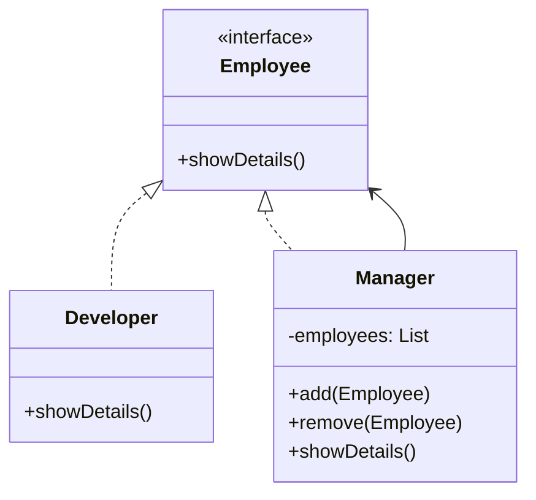
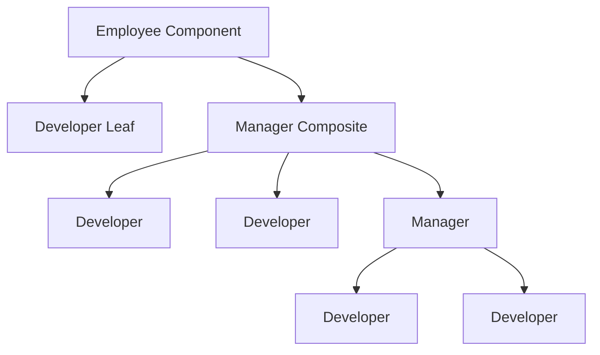
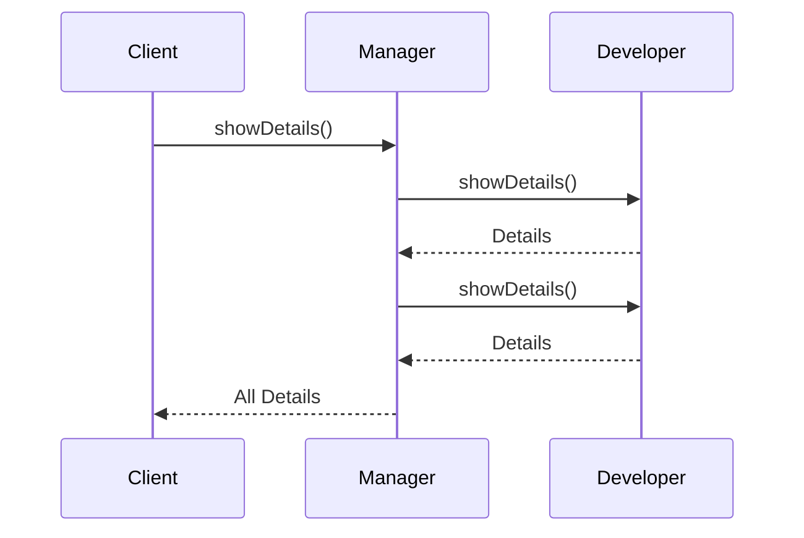

# Understanding Composite Pattern First

Before writing documentation, understand the core idea:

## What Problem Does It Solve?

Suppose you're building a File System.

You have:

```text
Folder
 ├── File
 ├── File
 └── Folder
      ├── File
      └── File
```

Question:

How should the client treat:

```java
File
```

and

```java
Folder
```

?

Without Composite Pattern:

```java
if(object instanceof File){
    ...
}

if(object instanceof Folder){
    ...
}
```

You constantly check object types.

This becomes messy.

---

## Goal of Composite Pattern

Treat:

```java
Single Object
```

and

```java
Group of Objects
```

the same way.

---

## Real World Example

Consider a company.

```text
CEO

├── Manager A
│     ├── Developer 1
│     └── Developer 2
│
└── Manager B
      ├── Developer 3
      └── Developer 4
```

Every person is an Employee.

Some employees:

```text
Developer
```

have no children.

Some employees:

```text
Manager
```

contain other employees.

The client should simply do:

```java
employee.showDetails();
```

without caring whether it's:

* CEO
* Manager
* Developer

This is Composite Pattern.

---

# Key Idea (Exam Definition)

> Composite Pattern is a Structural Design Pattern that allows individual objects and groups of objects to be treated uniformly.

---

# When Should You Use Composite Pattern?

Use Composite Pattern when:

### 1. Tree Structures Exist

Examples:

```text
Folders
Menus
Organizations
HTML DOM
UI Components
```

---

### 2. Part-Whole Hierarchy Exists

Examples:

```text
Company → Departments → Employees

Folder → Subfolders → Files

Menu → Submenus → Menu Items
```

---

### 3. Client Should Not Care

Client should not know whether it is working with:

```text
Single Object
```

or

```text
Collection of Objects
```

---

# Technical Terms

Students often lose marks because they memorize code but not terminology.

---

## Component

Common interface.

```java
interface Employee
```

Both leaf and composite implement this.

---

## Leaf

Individual object.

Cannot contain children.

Example:

```java
Developer
```

---

## Composite

Container object.

Can contain children.

Example:

```java
Manager
```

---

## Client

Uses Component interface.

```java
Employee emp;
```

Client doesn't know actual type.

---

# UML Diagram

This is the most important diagram for exams.



---

# Internal Structure



This diagram alone explains Composite Pattern.

---

# How It Works

Step-by-step:

```text
Client
   ↓
Component Interface
   ↓
Manager Composite
   ↓
Children Employees
   ↓
showDetails()
```

---

# Working Flow Diagram



---

# Simple Java Example

## Component

```java
interface Employee {
    void showDetails();
}
```

---

## Leaf

```java
class Developer implements Employee {

    private String name;

    public Developer(String name) {
        this.name = name;
    }

    @Override
    public void showDetails() {
        System.out.println(name);
    }
}
```

---

## Composite

```java
import java.util.ArrayList;
import java.util.List;

class Manager implements Employee {

    private String name;
    private List<Employee> employees =
            new ArrayList<>();

    public Manager(String name) {
        this.name = name;
    }

    public void add(Employee employee) {
        employees.add(employee);
    }

    @Override
    public void showDetails() {

        System.out.println(name);

        for(Employee emp : employees) {
            emp.showDetails();
        }
    }
}
```

---

## Client

```java
public class Main {

    public static void main(String[] args) {

        Developer d1 =
                new Developer("Ali");

        Developer d2 =
                new Developer("Ahmed");

        Manager manager =
                new Manager("Manager");

        manager.add(d1);
        manager.add(d2);

        manager.showDetails();
    }
}
```

---

## Output

```text
Manager
Ali
Ahmed
```

---

# How to Identify Composite Pattern in Exams

Look for these keywords:

* Tree Structure
* Hierarchy
* Parent Child Relationship
* Folder File System
* Organization Chart
* Menu Submenu
* Uniform Treatment
* Part Whole Structure

If these appear, Composite Pattern is usually the answer.

---

# Real Software Examples

### File Explorer

```text
Folder
 ├─ File
 ├─ File
 └─ Folder
```

---

### HTML DOM

```html
<body>
    <div>
        <p>Hello</p>
    </div>
</body>
```

Each element contains child elements.

---

### Organization Structure

```text
CEO
 ├─ Manager
 │   ├─ Developer
 │   └─ Developer
 └─ Manager
```

---

### Menu Systems

```text
File
 ├─ Open
 ├─ Save
 └─ Exit
```

---

# Advantages

### 1. Uniform Treatment

Leaf and composite are used the same way.

### 2. Simplifies Client Code

No type checking.

### 3. Easy Expansion

New leaf/composite classes can be added.

### 4. Supports Recursive Structures

Perfect for tree hierarchies.

---

# Disadvantages

### 1. Harder Design

Interfaces may become too general.

### 2. Difficult Restrictions

Hard to prevent invalid child additions.

---

# Composite vs Adapter

| Composite                 | Adapter                  |
| ------------------------- | ------------------------ |
| Builds tree structures    | Converts interfaces      |
| Focuses on hierarchy      | Focuses on compatibility |
| Parent-child relationship | Translator relationship  |

---

# Composite vs Decorator

| Composite            | Decorator           |
| -------------------- | ------------------- |
| Represents hierarchy | Adds behavior       |
| Many child objects   | Wraps single object |
| Tree structure       | Chain structure     |

---

# Viva Questions

### What is Composite Pattern?

A structural design pattern that treats individual objects and groups of objects uniformly.

### What problem does it solve?

It simplifies handling tree-like structures.

### Main Participants?

1. Component
2. Leaf
3. Composite
4. Client

### What is a Leaf?

Object without children.

### What is a Composite?

Object that contains children.

### Which data structure is most related?

Tree.

### Give real examples.

* File System
* Company Hierarchy
* HTML DOM
* Menus

---

# Memory Tip

```text
Composite = Tree Structure

Folder
 ├─ File
 ├─ File
 └─ Folder
      ├─ File
      └─ File

Treat everything as "FileSystemItem"
```


<Callout type="info">
If you remember **"Composite = Tree + Uniform Treatment"**, you'll be able to identify and explain the pattern in exams and interviews immediately.
</Callout>