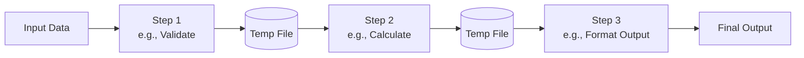

## 1. Definition

### Simple Definition
Batch sequential is an architecture where data is processed in **steps** – each step runs to completion before the next step starts. Data moves as a whole **batch** from one program to the next.

### One‑Line Exam Definition
*“A linear data‑flow architecture where each processing step finishes entirely before the next step begins, and data is transferred as a complete batch.”*

---

## 2. Why Do We Need It?

### The Problem It Solves
Some tasks need to process large amounts of data in a fixed order – for example, payroll: read employee file → calculate salaries → print checks. You cannot print checks before calculating.

### Why Was It Created?
Old computers (1950s–1970s) had limited memory and no real‑time interaction. Batch processing was the only practical way to handle large volumes of data.

### What Happens Without It?
Without a clear batch sequential design, steps could run out of order, or data would be incomplete for later steps → wrong results.

---

## 3. Real‑World Analogy

**Car assembly line** – each station finishes its job before the car moves to the next station. You cannot paint the car before welding the body. The whole batch of cars goes through each station in order.

---

## 4. When to Use Batch Sequential

- **Payroll processing** – read time sheets → calculate pay → print checks.
- **Bank statement generation** – process all transactions → compute interest → print statements.
- **Data migration** – extract → transform → load (ETL).
- **Report generation** – gather data → aggregate → format → print.
- **Any task where all input must be available before processing, and steps must run in strict order.**

---

## 5. Key Terms

| Term | Meaning |
|------|---------|
| **Batch** | A collection of data processed as a whole unit. |
| **Sequential** | One after another, in fixed order. |
| **Subsystem** | A program or module that performs one processing step. |
| **Latency** | Time delay – here, later steps wait for earlier steps to finish. |
| **Throughput** | Amount of data processed per time unit. |

---

## 6. Structure / Components

| Component | Purpose |
|-----------|---------|
| **Input data** | Raw data to be processed (e.g., transaction file). |
| **Processing steps** | Independent programs/modules each doing one transformation. |
| **Temporary storage** | Intermediate files or data stores between steps. |
| **Output data** | Final result after all steps. |

---

## 7. Diagram



**Rule:** Step 2 cannot start until Step 1 finishes all its data.

---

## 8. How It Works

1. **Collect all input data** into a batch (e.g., all day’s transactions).
2. **Run Step 1** on the entire batch – produces intermediate file.
3. **Step 1 finishes completely** before anything else runs.
4. **Run Step 2** on the intermediate file – produces next file.
5. **Continue** until all steps complete.
6. **Output** is ready – usually printed or stored.

No user interaction during processing. If a step fails, you restart the whole batch.

---

## 9. Simple Example

### Java Skeleton (from lecture PDF style)

```java
// Step 1: Read raw transactions
public class Step1Reader {
    public static void main(String[] args) {
        // Read all transactions from input file
        // Validate each record
        // Write valid records to "step1_output.txt"
    }
}

// Step 2: Calculate interest
public class Step2Calculator {
    public static void main(String[] args) {
        // Read "step1_output.txt"
        // Calculate interest for each account
        // Write to "step2_output.txt"
    }
}

// Step 3: Generate report
public class Step3Reporter {
    public static void main(String[] args) {
        // Read "step2_output.txt"
        // Format and print report
    }
}
```

**How to run:**  
`java Step1Reader && java Step2Calculator && java Step3Reporter`

Each step waits for the previous to finish.

---

## 10. Real Software Examples

| System | How It Uses Batch Sequential |
|--------|------------------------------|
| **Bank batch processing (nightly)** | End‑of‑day: apply deposits → compute interest → generate statements. |
| **Utility billing system** | Read meter data → calculate usage → generate bills. |
| **ETL tools (Informatica, Talend)** | Extract → Transform → Load – each step runs after previous. |
| **Payroll software (ADP, QuickBooks)** | Collect hours → compute gross pay → deduct taxes → print checks. |
| **Old mainframe job scheduling (IBM JCL)** | Job Control Language defined sequential steps: compile → link → run. |

---

## 11. Advantages

| Advantage | Why It’s Good |
|-----------|---------------|
| **Simple to understand** | Linear flow – easy to design and debug. |
| **Each step is independent** | You can write and test each program separately. |
| **Reliable** | No concurrency issues – no race conditions. |
| **Good for huge data volumes** | Optimised for sequential reads/writes. |

---

## 12. Disadvantages

| Disadvantage | Why It’s Bad |
|--------------|---------------|
| **No interactivity** | Cannot stop and ask user a question mid‑process. |
| **High latency** | Later steps wait for whole batch – no early results. |
| **No concurrency** | Only one step runs at a time – underuses modern CPUs. |
| **Restart is expensive** | If step 2 fails, you rerun from step 1 (or need checkpoints). |
| **Static order** | Hard to change the sequence of steps. |

---

## 13. How to Identify in Exams

### Exam Keywords

| Keyword | Why It Points to Batch Sequential |
|---------|-----------------------------------|
| “Processes a batch of data” | Direct match. |
| “Step by step, one after another” | Sequential nature. |
| “No user interaction during processing” | Batch characteristic. |
| “Nightly processing” / “End of day” | Typical batch timing. |
| “Each step runs to completion” | Core definition. |

---

## 14. Comparison – Batch Sequential vs Pipe‑and‑Filter

| Aspect | Batch Sequential | Pipe‑and‑Filter |
|--------|------------------|------------------|
| **Data flow** | Whole batch | Streaming data |
| **Concurrency** | No – step by step | Yes – filters run concurrently |
| **Latency** | High (wait for batch) | Low (incremental results) |
| **Interactive?** | No | Usually no, but can be |
| **Memory use** | Needs storage for intermediate files | Streams through pipes |
| **Example** | Payroll batch | Unix `grep | sort | wc` |

---

## 15. Viva Questions

| # | Question | Answer |
|---|----------|--------|
| 1 | What is batch sequential architecture? | Data processed in linear steps; each step finishes before next starts. |
| 2 | Name a real example. | Bank end‑of‑day batch processing. |
| 3 | What is a major disadvantage? | High latency – you wait for entire batch to finish. |
| 4 | Can batch sequential be interactive? | No – no user interaction during processing. |
| 5 | How does batch sequential differ from pipe‑and‑filter? | Batch sequential processes whole batch; pipe‑and‑filter streams data concurrently. |
| 6 | Why was batch sequential popular in the past? | Old computers had limited memory and no real‑time OS. |
| 7 | What happens if a step fails? | Usually you restart from the beginning or last checkpoint. |
| 8 | Is batch sequential still used today? | Yes – for payroll, billing, ETL jobs. |
| 9 | What is “throughput” in batch sequential? | Amount of data processed per time unit – limited by slowest step. |
| 10 | Does batch sequential support concurrency? | No – only one step runs at a time. |

---

## 16. Memory Tip

**“Step by Step, Whole Batch”** – remember:
- **Step by Step** = sequential
- **Whole Batch** = no streaming, all data moves together

Analogy: **A train where each carriage is processed at a station before the train moves to the next station.**

---

## 17. Quick Revision

### Category
Data Flow Architectural Style

### Problem
Need to process large volumes of data in a fixed order of transformations (e.g., payroll, billing). Without a clear structure, steps could run out of order or data would be incomplete.

### Solution
Batch sequential: break processing into independent steps; each step runs to completion on the entire batch; data moves via temporary files.

### Key Components
- Input batch
- Processing steps (programs/modules)
- Intermediate storage
- Output

### Advantages
Simple, independent steps, reliable (no concurrency issues), good for large data.

### Disadvantages
No interactivity, high latency, no concurrency, expensive restart.

### Keywords
Batch, sequential, linear data flow, step‑by‑step, ETL, payroll, overnight processing.

### One‑Line Exam Definition
*“Architecture where each processing step finishes entirely before the next starts, processing data as a whole batch.”*

### One‑Line Summary
**Batch sequential = linear steps, whole batch, no interaction.**

---

<Callout type="info">
  **Exam Tip:** When asked for advantages/disadvantages of batch sequential, remember: **Simple and reliable** (pro) vs **slow and non‑interactive** (con). Compare with pipe‑and‑filter for extra marks.
</Callout>