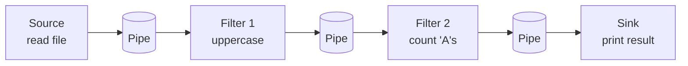
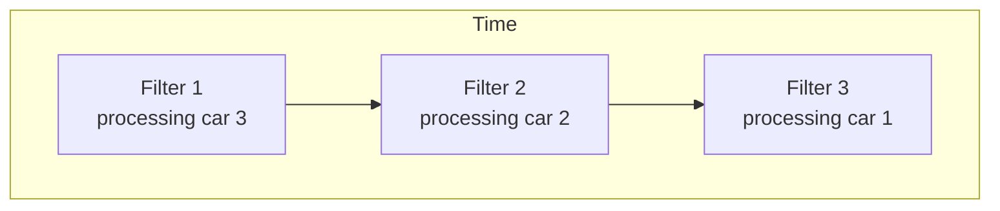

## 1. Definition

### Simple Definition
Pipe‑and‑filter is an architecture where data flows through a series of **filters** (processing steps) connected by **pipes** (communication channels). Each filter processes data and passes it to the next filter **incrementally** – no need to wait for the whole batch.

### One‑Line Exam Definition
*“Architecture where independent filters process data streams concurrently, connected by pipes that pass data incrementally.”*

---

## 2. Why Do We Need It?

### The Problem It Solves
Batch sequential processes the whole batch before the next step starts – this is **slow** and uses a lot of temporary storage. If you want to see early results or use multiple CPU cores, batch sequential is inefficient.

### Why Was It Created?
To enable **concurrent processing** and **streaming** – filters can work at the same time on different pieces of data, and output appears incrementally.

### What Happens Without It?
Without pipe‑and‑filter, you either:
- Use batch sequential (slow, high latency), or
- Write one giant program (hard to reuse and maintain).

---

## 3. Real‑World Analogy

**Car wash** – cars enter, go through wash → rinse → dry. Each station (filter) works on one car and passes it to the next. Multiple cars can be in different stations at the same time (concurrency). You don’t wait for all cars to finish washing before starting rinse.

---

## 4. When to Use Pipe‑and‑Filter

- **Data transformation pipelines** – convert → validate → enrich → output.
- **Unix command line** – `cat file | grep "error" | sort | uniq`
- **Media processing** – read video → decode → scale → encode → write.
- **Compilers** – source → lex → parse → semantic → code generation.
- **Any task where data can be processed incrementally and filters are independent.**

---

## 5. Key Terms

| Term | Meaning |
|------|---------|
| **Filter** | A processing component that transforms input data to output data. |
| **Pipe** | A communication channel that moves data from one filter to the next. |
| **Stream** | Continuous flow of data (not a complete batch). |
| **Concurrency** | Multiple filters running simultaneously on different data. |
| **Incremental processing** | Producing output as soon as input arrives, not waiting for all data. |

---

## 6. Structure / Components

| Component | Purpose |
|-----------|---------|
| **Filter** | Does one transformation (e.g., uppercase, count, sort). Pure function ideally – no state shared with other filters. |
| **Pipe** | Connects filters. Usually a FIFO buffer. Passes data incrementally. |
| **Source** | First filter that produces data from outside (e.g., read file). |
| **Sink** | Last filter that consumes data (e.g., print, write to file). |

**Rule:** Filters only communicate via pipes – no direct coupling.

---

## 7. Diagram

### Simple Pipe‑and‑Filter



### Concurrency Illustration



Filters run in parallel on different data items.

---

## 8. How It Works

1. **Data enters** the first filter (source).
2. **Filter processes** one piece of data (e.g., one line, one chunk).
3. **Filter writes** output to its outgoing pipe – doesn’t wait for all data.
4. **Next filter reads** from the pipe as soon as data is available.
5. **All filters run concurrently** – while Filter 1 processes item 2, Filter 2 processes item 1.
6. **Output appears incrementally** – you see results before entire input is processed.

**Key point:** Filters are independent, reusable, and can be rearranged or replaced.

---

## 9. Simple Example

### Unix Command Line (Real Pipe‑and‑Filter)

```bash
# Count occurrences of "ERROR" in a log file
cat app.log | grep "ERROR" | wc -l
```

- `cat app.log` – source filter (reads file)
- `grep "ERROR"` – filter (keeps only lines with ERROR)
- `wc -l` – sink filter (counts lines)

Pipes (`|`) connect them. All run concurrently.

### Java Example – Simulating Pipe‑and‑Filter

```java
// Filter: uppercase converter (simplified)
public class UppercaseFilter {
    public void process(InputStream input, OutputStream output) {
        try (BufferedReader reader = new BufferedReader(new InputStreamReader(input));
             PrintWriter writer = new PrintWriter(output)) {
            String line;
            while ((line = reader.readLine()) != null) {
                writer.println(line.toUpperCase());
                writer.flush(); // send incrementally
            }
        }
    }
}

// Filter: count 'A's
public class CountAFilter {
    private int total = 0;
    
    public void process(InputStream input, OutputStream output) {
        try (BufferedReader reader = new BufferedReader(new InputStreamReader(input))) {
            String line;
            while ((line = reader.readLine()) != null) {
                int count = line.length() - line.replace("A", "").length();
                total += count;
                System.out.println("Current count: " + total); // incremental output
            }
        }
    }
}
```

---

## 10. Real Software Examples

| System | How It Uses Pipe‑and‑Filter |
|--------|------------------------------|
| **Unix/Linux shell** | Command pipelines (`cmd1 | cmd2 | cmd3`). |
| **Apache Camel** | Integration framework using pipes (routes) and filters (processors). |
| **Java Streams API** | `stream().map().filter().reduce()` – each operation is a filter. |
| **Media transcoding (FFmpeg)** | Decode → filter → encode → mux – each stage a filter. |
| **Logstash (ELK stack)** | Input → filter → output – parsing logs incrementally. |
| **Compilers (GCC, javac)** | Lexical analysis → parsing → semantic → code gen – each stage a filter. |

---

## 11. Advantages

| Advantage | Why It’s Good |
|-----------|---------------|
| **Low coupling** | Filters only know pipes, not other filters – easy to replace. |
| **High reusability** | Same filter can be used in different pipelines (e.g., `grep` everywhere). |
| **Concurrency** | Filters run in parallel – better CPU utilisation, faster processing. |
| **Incremental output** | See results early – good for long‑running tasks. |
| **Easy to add/remove steps** | Just insert or remove a filter in the pipeline. |

---

## 12. Disadvantages

| Disadvantage | Why It’s Bad |
|--------------|---------------|
| **Static pipeline** | Once built, pipeline structure rarely changes at runtime (hard to reconfigure dynamically). |
| **Not good for interactive applications** | Error handling is difficult – errors must travel backwards or break the pipe. |
| **Overhead of pipes** | Marshalling/unmarshalling data between filters adds cost. |
| **Shared state is difficult** | Filters should be stateless; if you need shared state, pipe‑and‑filter is awkward. |
| **Debugging can be hard** | You see a stream of data, not a single snapshot of all variables. |

---

## 13. How to Identify in Exams

### Exam Keywords

| Keyword | Why It Points to Pipe‑and‑Filter |
|---------|-----------------------------------|
| “Stream of data” | Incremental processing, not batch. |
| “Concurrent execution of processing steps” | Filters run in parallel. |
| “Pipe” / “Filter” | Direct component names. |
| “Unix command line with `|`” | Classic example. |
| “Data flows through transformations” | Core description. |
| “Independent processors connected by channels” | Definition. |

---

## 14. Comparison – Pipe‑and‑Filter vs Batch Sequential

| Aspect | Pipe‑and‑Filter | Batch Sequential |
|--------|------------------|------------------|
| **Data unit** | Stream (incremental) | Whole batch |
| **Concurrency** | Yes – filters run in parallel | No – one step at a time |
| **Latency** | Low – early results appear | High – wait for batch |
| **Storage needed** | Small buffers (pipes) | Large intermediate files |
| **Reusability** | High – filters are like Lego blocks | Moderate – each step often custom |
| **Error handling** | Hard – errors break the stream | Easier – restart from step |
| **Typical example** | Unix pipelines | Payroll batch |

---

## 15. Viva Questions

| # | Question | Answer |
|---|----------|--------|
| 1 | What is a filter? | A component that transforms input data to output data. |
| 2 | What is a pipe? | A communication channel that moves data between filters. |
| 3 | Name a real example of pipe‑and‑filter. | Unix command line: `grep "error" file.txt | sort | uniq`. |
| 4 | How does pipe‑and‑filter achieve concurrency? | Filters run on different data items at the same time. |
| 5 | What is the main advantage over batch sequential? | Lower latency – you get results incrementally. |
| 6 | Can filters share state? | Not easily – they should be stateless and independent. |
| 7 | What happens if a filter fails? | The pipe breaks; downstream filters get EOF or error. |
| 8 | Is pipe‑and‑filter good for interactive UI? | Not really – error handling and back‑and‑forth communication is hard. |
| 9 | Name a Java technology similar to pipe‑and‑filter. | Java Streams API (`map`, `filter`, `reduce`). |
| 10 | What is a sink? | The final filter that consumes data (e.g., print, write to file). |

---

## 16. Memory Tip

**“Pipes connect Filters, Streams flow”**

Analogy: **Factory conveyor belt** – each worker (filter) does one job on a product and pushes it down the belt (pipe). Multiple workers work at the same time on different products.

Unix mnemonic: **`cmd1 | cmd2 | cmd3`** – the vertical bar `|` is the pipe.

---

## 17. Quick Revision

### Category
Data Flow Architectural Style

### Problem
Batch sequential is slow (no concurrency) and has high latency. Need incremental, parallel processing of data streams.

### Solution
Pipe‑and‑filter: independent filters connected by pipes; data flows incrementally; filters run concurrently.

### Key Components
- **Filter** – processing component
- **Pipe** – data channel (FIFO)
- **Source** – first filter
- **Sink** – last filter

### Advantages
Low coupling, high reusability, concurrency, incremental output.

### Disadvantages
Static pipeline, poor error handling, overhead, hard shared state.

### Keywords
Pipe, filter, stream, concurrent, incremental, Unix pipeline, data flow.

### One‑Line Exam Definition
*“Architecture where independent processing components (filters) are connected by pipes, passing data incrementally and concurrently.”*

### One‑Line Summary
**Pipe‑and‑filter = streaming Lego blocks for data processing.**

---

<Callout type="success">
  **Exam Tip:** When comparing with batch sequential, always mention **concurrency** and **incremental output** as key advantages, and **error handling** as a disadvantage.
</Callout>
