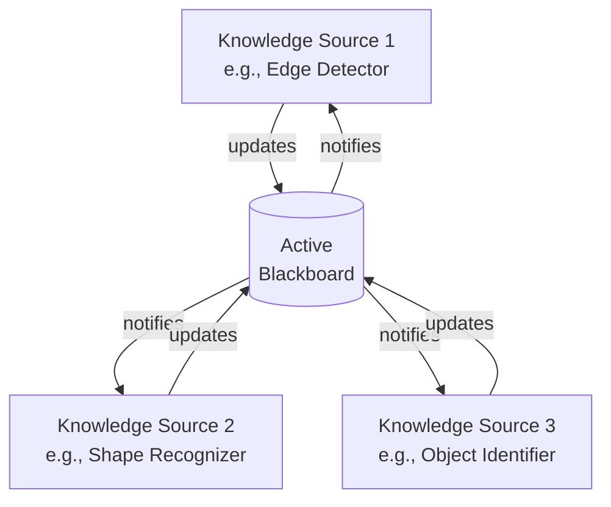
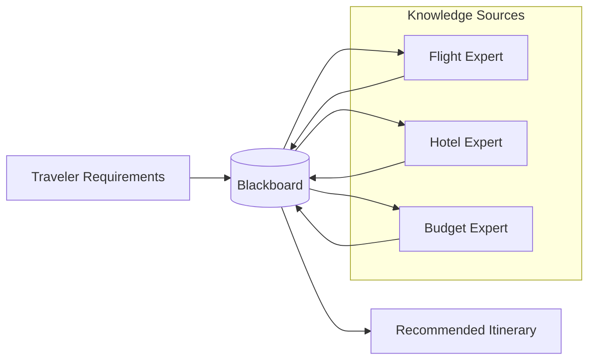

## 1. Definition

### Simple Definition
Blackboard architecture is a style where a **central active data store** (the blackboard) holds data, and independent components (knowledge sources) **react to changes** in that data. When data changes, the blackboard triggers components to respond – it’s “data‑driven”.

### One‑Line Exam Definition
*“An active repository where data changes trigger events, causing independent knowledge sources to respond and update the data further.”*

---

## 2. Why Do We Need It?

### The Problem It Solves
In many complex problems (like voice recognition or security monitoring), you don’t have a fixed sequence of steps. Instead, different experts look at partial results and contribute their knowledge. The solution emerges incrementally.

### Why Was It Created?
To solve problems where:
- No single algorithm can solve the entire problem.
- Multiple sources of expertise are needed.
- The solution evolves step by step based on current data.

### What Happens Without It?
You would need to hardcode a fixed processing order – but for problems like speech recognition, you don’t know in advance which expert should work next. Blackboard lets the data itself decide.

---

## 3. Real‑World Analogy

**Crime scene investigation** – Detectives (knowledge sources) look at a blackboard (shared evidence board). When new evidence is added (e.g., fingerprint results), the board “triggers” the relevant experts (e.g., fingerprint specialist, witness interviewer) to update their findings and add more evidence. The solution (solving the crime) emerges step by step.

---

## 4. When to Use Blackboard

- **Voice recognition systems** – phonemes → words → sentences, each level contributes.
- **Image / pattern recognition** – detect edges → shapes → objects.
- **Security monitoring** – motion detection → camera tracking → alert generation.
- **Resource management systems** – travel consulting (flights, hotels, budget).
- **Any problem where the solution emerges incrementally and multiple experts contribute.**

---

## 5. Key Terms

| Term | Meaning |
|------|---------|
| **Blackboard** | Active central data store. Holds current solution state. Triggers events when data changes. |
| **Knowledge Sources (KS)** | Independent components that contain domain expertise. They react to blackboard changes. |
| **Controller** | Optional component that decides which knowledge source gets to run next (scheduling). |
| **Implicit invocation** | Knowledge sources are not called directly – they are triggered by data changes (event‑driven). |
| **Passive vs Active** | Repository = passive (clients ask). Blackboard = active (blackboard calls clients). |

---

## 6. Structure / Components

| Component | Purpose |
|-----------|---------|
| **Blackboard** | Shared data store – active. Notifies listeners when data changes. |
| **Knowledge Sources** | Independent modules with specific knowledge. They register interest in certain data changes. When triggered, they read blackboard, compute, and post new data. |
| **Controller** | (Optional) Schedules which knowledge source runs next – manages priorities and conflict resolution. |

**Flow:** Data changes on blackboard → blackboard notifies interested knowledge sources → knowledge sources update blackboard → more changes → continues until solution is reached.

---

## 7. Diagram

### Blackboard Architecture



### Travel Consulting Example (from slides)



---

## 8. How It Works

1. **Initial data** is posted to the blackboard (e.g., a spoken utterance or a traveler’s budget).
2. **Blackboard notifies** all knowledge sources that have registered interest in that type of data.
3. **Each knowledge source** reads the blackboard, applies its expertise, and adds new data (partial solution) to the blackboard.
4. **New data triggers** more knowledge sources – the process repeats.
5. **Controller** (if present) decides which knowledge source runs first when multiple are triggered – based on priority, recency, or other heuristics.
6. **Solution emerges** incrementally – the blackboard eventually contains a complete answer.
7. **Termination** – when a knowledge source determines that the goal is reached, or no more changes occur.

**Key difference from repository:** Here, the blackboard *calls* the knowledge sources – not the other way around.

---

## 9. Simple Example

### Voice Recognition – Simplified

```java
// Blackboard – active data store
public class VoiceBlackboard {
    private String currentPhonemes = "";
    private String currentWords = "";
    private String currentSentence = "";
    private List<KnowledgeSource> listeners = new ArrayList<>();
    
    public void addListener(KnowledgeSource ks) {
        listeners.add(ks);
    }
    
    public void setPhonemes(String phonemes) {
        this.currentPhonemes = phonemes;
        notifyListeners("phonemesChanged");
    }
    
    public String getPhonemes() { return currentPhonemes; }
    public String getWords() { return currentWords; }
    public void setWords(String words) { this.currentWords = words; }
    public void setSentence(String sentence) { this.currentSentence = sentence; }
    
    private void notifyListeners(String event) {
        for (KnowledgeSource ks : listeners) {
            if (ks.isInterested(event)) {
                ks.update(this);
            }
        }
    }
}

// Knowledge Source: converts phonemes to words
public class PhonemeToWordKS implements KnowledgeSource {
    @Override
    public boolean isInterested(String event) {
        return "phonemesChanged".equals(event);
    }
    
    @Override
    public void update(VoiceBlackboard board) {
        String phonemes = board.getPhonemes();
        // Convert phonemes to words (simplified)
        String words = convert(phonemes);
        board.setWords(words);
        System.out.println("Words: " + words);
    }
}

// Knowledge Source: converts words to sentence
public class WordToSentenceKS implements KnowledgeSource {
    @Override
    public boolean isInterested(String event) {
        // Wait until words are non‑empty
        return true; // simplified – would check board state
    }
    
    @Override
    public void update(VoiceBlackboard board) {
        String words = board.getWords();
        if (!words.isEmpty()) {
            String sentence = buildSentence(words);
            board.setSentence(sentence);
            System.out.println("Sentence: " + sentence);
        }
    }
}
```

---

## 10. Real Software Examples

| System | How It Uses Blackboard |
|--------|------------------------|
| **Speech recognition (Siri, Google Voice)** | Phonemes → words → sentences – each level contributes. |
| **Intrusion detection systems** | Motion sensor → camera tracking → face recognition → alert. |
| **Travel planning assistants** | Budget → flight search → hotel search → combine into itinerary. |
| **Medical diagnosis systems** | Symptoms → tests → possible diseases → final diagnosis. |
| **Chess playing programs** | Board state triggers different move evaluators (opening, midgame, endgame). |

---

## 11. Advantages

| Advantage | Why It’s Good |
|-----------|---------------|
| **Scalability** | Easy to add new knowledge sources – just register them. |
| **Concurrency** | Knowledge sources can run in parallel (if controller allows). |
| **Reusability** | Knowledge sources are independent and can be used in different systems. |
| **Supports incomplete solutions** | Works well when only partial answers are available. |
| **Flexible reasoning** | The data itself controls the flow – not a fixed algorithm. |

---

## 12. Disadvantages

| Disadvantage | Why It’s Bad |
|--------------|---------------|
| **Tight coupling to blackboard structure** | Changing the blackboard data format affects all knowledge sources. |
| **Difficult to know when to stop** | System may keep improving the solution forever – needs termination condition. |
| **Synchronisation complexity** | Multiple knowledge sources updating blackboard at the same time can cause conflicts. |
| **Hard to debug** | The order of execution is not predetermined – emergent behaviour is tricky to test. |
| **Controller becomes complex** | Deciding which knowledge source runs next can be a problem in itself. |

---

## 13. How to Identify in Exams

### Exam Keywords

| Keyword | Why It Points to Blackboard |
|---------|----------------------------|
| “Active data store” | Blackboard is active, not passive. |
| “Knowledge sources” | Unique term for components. |
| “Implicit invocation” / “Event‑driven” | Blackboard triggers components. |
| “Data changes trigger processing” | Core mechanism. |
| “Speech recognition” / “Pattern recognition” / “AI problems” | Classic domains. |
| “No fixed algorithm order” | Solution emerges incrementally. |

---

## 14. Comparison – Repository (Passive) vs Blackboard (Active)

| Aspect | Repository | Blackboard |
|--------|------------|------------|
| **Data store role** | Passive – just stores data | Active – triggers events |
| **Who initiates** | Clients ask repository | Blackboard notifies clients |
| **Control flow** | Client‑driven | Data‑driven |
| **Communication** | Clients call repository | Blackboard calls knowledge sources |
| **Typical use** | Business databases | AI, pattern recognition, monitoring |
| **Example** | Banking system | Voice recognition |

---

## 15. Viva Questions

| # | Question | Answer |
|---|----------|--------|
| 1 | What is blackboard architecture? | An active central data store that triggers independent knowledge sources when data changes. |
| 2 | How is it different from repository? | Repository is passive (clients ask); blackboard is active (blackboard notifies). |
| 3 | What are knowledge sources? | Independent components that contain domain expertise and react to blackboard changes. |
| 4 | Give a real example. | Speech recognition – phonemes to words to sentences. |
| 5 | What is the role of the controller? | Schedules which knowledge source runs next when multiple are triggered. |
| 6 | What does “implicit invocation” mean? | Knowledge sources are not called directly – they are invoked automatically by data changes. |
| 7 | Why is termination difficult? | The system might keep improving the solution forever – need a goal detection mechanism. |
| 8 | Name an advantage of blackboard. | Easy to add new knowledge sources (scalability). |
| 9 | What is a disadvantage? | Tight coupling – changing blackboard structure affects all knowledge sources. |
| 10 | When should you use blackboard? | When there is no fixed algorithm and multiple experts need to contribute incrementally. |

---

## 16. Memory Tip

**“Blackboard = Bulletin board with alarms”** – a bulletin board that screams when something new is posted, so experts rush to respond.

Compare with repository: **Repository = filing cabinet** – you go and look when you want.

---

## 17. Quick Revision

### Category
Data‑Centered Architectural Style

### Problem
Need a solution that emerges incrementally from multiple experts; no fixed algorithm order exists.

### Solution
Active blackboard stores data. Knowledge sources register interest. Data changes trigger appropriate knowledge sources. They update the blackboard → more triggers → solution emerges.

### Key Components
- Blackboard (active data store)
- Knowledge sources (experts)
- Controller (optional – scheduling)

### Advantages
Scalable (add knowledge sources), concurrent, reusable, handles incomplete solutions.

### Disadvantages
Coupling to blackboard, termination hard, synchronisation complex, debugging difficult.

### Keywords
Blackboard, active, knowledge sources, implicit invocation, data‑driven, controller.

### One‑Line Exam Definition
*“An architecture where an active central data store triggers independent knowledge sources to respond to data changes.”*

### One‑Line Summary
**Blackboard = data‑driven collaboration of experts.**

---

<Callout type="success">
  **Exam Tip:** When comparing repository vs blackboard, always emphasise **passive vs active** and **client‑driven vs data‑driven**. For blackboard, mention speech recognition as the classic example.
</Callout>