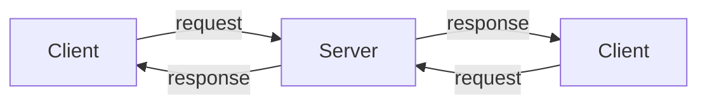

## 1. Definition

### Simple Definition
Client‑server splits a system into two parts: **clients** (requesters) and **servers** (providers). Clients ask, servers answer.

### One‑Line Exam Definition
*“A distributed architecture where active clients request services from reactive servers, which respond but never initiate communication.”*

---

## 2. Why Do We Need It?

### The Problem It Solves
Without separation, each computer does everything – hard to manage, secure, and scale.

### Why Was It Created?
To centralise data and services on powerful servers while letting many clients access them.

### What Happens Without It?
Every user has their own copy of data → inconsistency, security risks, no sharing.

---

## 3. Real‑World Analogy

**Restaurant** – customer (client) orders, chef (server) prepares food. Chef never walks to customer’s table to ask “want food?” – only reacts when customer asks.

---

## 4. When to Use It

- Web browsing (browser = client, web server = server).
- Email (email client, mail server).
- Database applications (app client, database server).
- File sharing (FTP client, FTP server).

---

## 5. Key Terms

| Term | Meaning |
|------|---------|
| **Client** | Active entity – initiates requests, waits for responses. |
| **Server** | Reactive entity – cannot initiate; only answers requests. |
| **Thin client** | Client with little logic (mostly UI). |
| **Fat client** | Client with presentation + business logic. |

---

## 6. Structure / Components

| Component | Purpose |
|-----------|---------|
| **Client** | Sends requests, displays results. |
| **Server** | Processes requests, manages resources. |
| **Network** | Communication medium. |

**Rule:** Servers are reactive – they never call clients.

---

## 7. Diagram



---

## 8. How It Works

1. **Client starts** – sends request to server.
2. **Server receives** – processes request (e.g., query database).
3. **Server sends** response back.
4. **Client displays** result.
5. **Client may send** another request.

---

## 9. Simple Example

```java
// Server side (simplified)
public class SimpleServer {
    public static void main(String[] args) {
        ServerSocket server = new ServerSocket(8080);
        while (true) {
            Socket client = server.accept(); // wait for client
            // read request, process, send response
        }
    }
}

// Client side
public class SimpleClient {
    public static void main(String[] args) {
        Socket socket = new Socket("localhost", 8080);
        // send request, receive response
    }
}
```

**Explanation:** Client initiates connection; server waits and reacts.

---

## 10. Real Software Examples

| System | Client | Server |
|--------|--------|--------|
| **Web browsing** | Browser | Web server (Apache, Nginx) |
| **Email** | Outlook, Gmail app | Mail server (SMTP/IMAP) |
| **Database** | SQL client (MySQL Workbench) | Database server (MySQL, PostgreSQL) |
| **File transfer** | FTP client | FTP server |

---

## 11. Advantages

| Advantage | Why It’s Good |
|-----------|---------------|
| **Separation of responsibilities** | UI separate from data logic. |
| **Reusability** | Same server serves many clients. |
| **Centralised control** | Data and security managed on server. |

---

## 12. Disadvantages

| Disadvantage | Why It’s Bad |
|--------------|---------------|
| **Server availability** | Server down → all clients stop. |
| **Security complications** | Network exposure, authentication needed. |
| **Fat client problem** | If business logic in client, change requires updating all clients. |
| **Heavy message traffic** | Many requests may overload network. |

---

## 13. How to Identify in Exams

### Exam Keywords

| Keyword | Why It Points to Client‑Server |
|---------|-------------------------------|
| “Client requests, server responds” | Core definition. |
| “Active vs reactive” | Client active, server reactive. |
| “Thin / fat client” | Client types. |
| “Two‑tier” | Basic client‑server (2 tiers). |

---

## 14. Comparison – Thin vs Fat Client

| Aspect | Thin Client | Fat Client |
|--------|-------------|------------|
| **Logic location** | Mostly on server | Business logic on client |
| **Network load** | Higher (more trips) | Lower (local processing) |
| **Update effort** | Easy (update server) | Hard (update all clients) |
| **Example** | Web browser | Old desktop app |

---

## 15. Viva Questions

| # | Question | Answer |
|---|----------|--------|
| 1 | What is client‑server architecture? | Clients request services from servers; servers respond. |
| 2 | Who initiates communication? | Client (active). |
| 3 | Can a server start communication? | No – servers are reactive. |
| 4 | Give a real example. | Web browser (client) and web server. |
| 5 | What is a thin client? | Client with little logic – mostly UI. |
| 6 | What is a disadvantage of fat client? | Logic changes need all clients updated. |
| 7 | How does client‑server help reusability? | One server serves many clients. |

---

## 16. Memory Tip

**“Client calls, server waits”** – like customer orders, chef cooks.

---

## 17. Quick Revision

### Category
Distributed Architecture

### Problem
Need centralised data and services accessible by many users.

### Solution
Split into clients (requesters) and servers (providers). Servers are reactive.

### Key Components
- Client (active)
- Server (reactive)
- Network

### Advantages
Separation, reusability, centralised control.

### Keywords
Client, server, active, reactive, thin client, fat client, request, response.

### One‑Line Exam Definition
*“Active clients request services from reactive servers which never initiate communication.”*

### One‑Line Summary
**Client‑Server = asker and answerer – client asks, server answers.**

---

<Callout type="success">
  **Exam Tip:** Remember “client is active, server is reactive”. This is often asked.
</Callout>