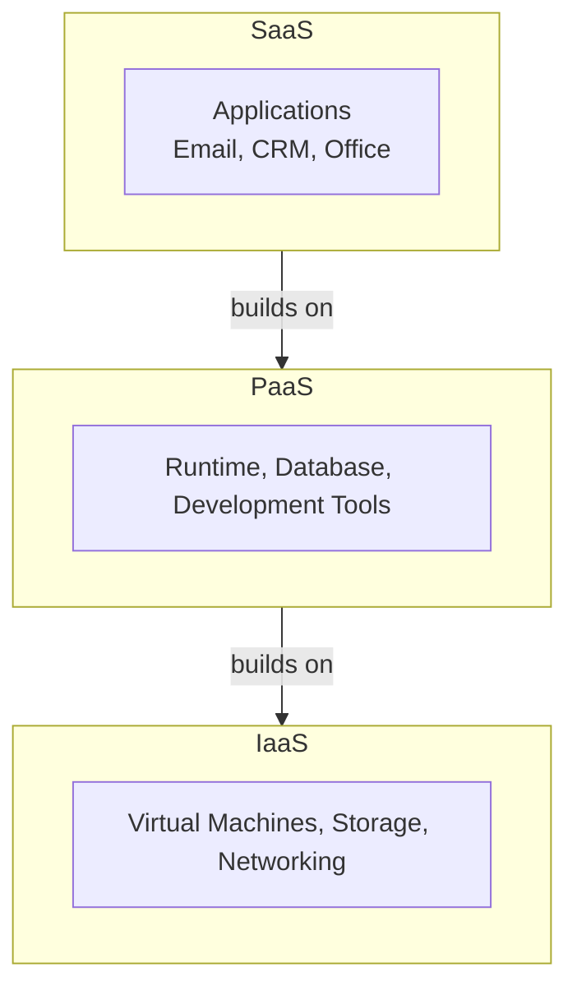
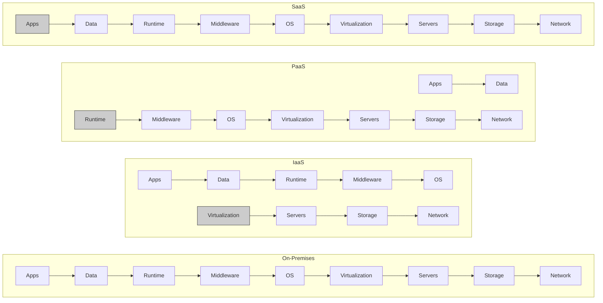

# Cloud Service Models – *IaaS, PaaS, SaaS*

## 1. Definition

### Simple Definition
Cloud computing offers three main service models: **IaaS** (infrastructure), **PaaS** (platform), and **SaaS** (software). Each provides a different level of control and management.

### One‑Line Exam Definition
*“IaaS gives raw infrastructure, PaaS gives a development platform, SaaS gives ready‑to‑use software – all delivered over the internet.”*

---

## 2. Why Do We Need Them?

### The Problem They Solve
Buying and managing your own servers, operating systems, and software is expensive and time‑consuming.

### Why Were They Created?
To let companies focus on their business instead of IT management. Pay only for what you use.

### What Happens Without Them?
Each company needs its own data centre, IT staff, and hardware – high cost and slow scaling.

---

## 3. Real‑World Analogy

**Travel options:**
- **IaaS** = rent a vacant land – you build everything (roads, building, utilities).
- **PaaS** = rent a furnished apartment – you just bring your belongings.
- **SaaS** = stay in a hotel – everything is ready; just use.

---

## 4. When to Use Each

| Model | When to Use |
|-------|-------------|
| **IaaS** | Need full control over OS, storage, networking. Run any software. |
| **PaaS** | Focus on coding; don’t want to manage servers, runtime, middleware. |
| **SaaS** | Need ready‑to‑use application (email, CRM, office tools). |

---

## 5. Key Terms

| Term | Meaning |
|------|---------|
| **IaaS** | Infrastructure as a Service – virtual machines, storage, networks. |
| **PaaS** | Platform as a Service – runtime, middleware, database, development tools. |
| **SaaS** | Software as a Service – complete application accessed via browser. |
| **Multitenancy** | One instance of software serves many customers (SaaS). |
| **Subscription model** | Pay monthly/yearly instead of one‑time purchase. |

---

## 6. Structure / Components

### IaaS (Infrastructure)
- Virtual machines (compute)
- Storage (block, object, file)
- Networking (virtual networks, load balancers)
- Hypervisor

**User manages:** OS, middleware, runtime, data, applications.

### PaaS (Platform)
- Runtime environment (e.g., Java, Node.js, Python)
- Database (managed)
- Development tools (CI/CD, testing)
- Middleware (messaging, caching)

**User manages:** Application code only.

### SaaS (Software)
- Complete application (email, CRM, office suite)
- No installation, browser access
- Multitenant architecture

**User manages:** Nothing – just uses the software.

---

## 7. Diagram

### Cloud Service Model Stack (from slides)



# Who Manages What?



(Grey = managed by cloud provider; white = managed by customer)

---

## 8. How Each Model Works

### IaaS
1. Choose a virtual machine (CPU, RAM, disk).
2. Choose OS (Windows, Linux).
3. Deploy your application (you manage OS, updates, security).
4. Pay per hour/month for the VM.

### PaaS
1. Write your application code.
2. Deploy to platform (e.g., Heroku, Google App Engine, AWS Elastic Beanstalk).
3. Platform automatically runs, scales, and manages infrastructure.
4. Pay for resources used.

### SaaS
1. Sign up for subscription.
2. Access software via browser (no install).
3. Vendor manages everything – updates, security, backups.
4. Pay per user/month.

---

## 9. Simple Examples

### IaaS – AWS EC2
```java
// You launch a virtual machine, SSH into it, install Java, deploy your .jar
// You manage everything above the hypervisor.
```

### PaaS – Heroku
```bash
# You just push code
git push heroku main
# Platform builds, deploys, runs your app
```

### SaaS – Gmail
```text
Open browser, go to gmail.com, login, use email. Nothing to install or manage.
```

---

## 10. Real Software Examples

| Model | Example Providers | Real Use |
|-------|------------------|----------|
| **IaaS** | AWS EC2, Google Compute Engine, Azure VMs | Host a custom Linux server. |
| **PaaS** | Heroku, Google App Engine, AWS Elastic Beanstalk | Deploy a web app without managing servers. |
| **SaaS** | Gmail, Salesforce, Office 365, Dropbox | Use software without installation. |

---

## 11. Advantages of Each

| Model | Advantages |
|-------|------------|
| **IaaS** | Full control, no hardware costs, scalable. |
| **PaaS** | No infrastructure management, faster development, built‑in scaling. |
| **SaaS** | No installation, automatic updates, access from anywhere. |

---

## 12. Disadvantages

| Model | Disadvantages |
|-------|---------------|
| **IaaS** | You still manage OS, patches, security – operational overhead. |
| **PaaS** | Vendor lock‑in (platform‑specific APIs), less control. |
| **SaaS** | Limited customisation, data security concerns (cloud). |

---

## 13. How to Identify in Exams

### Exam Keywords

| Keyword | Points to |
|---------|-----------|
| “Virtual machines, storage, network” | IaaS |
| “Runtime, database, development tools” | PaaS |
| “Ready‑to‑use software, browser access” | SaaS |
| “Subscription model, multitenant” | SaaS (often) |
| “No infrastructure management” | PaaS |

---

## 14. Comparison – IaaS vs PaaS vs SaaS

| Feature | IaaS | PaaS | SaaS |
|---------|------|------|------|
| **What you get** | Raw compute, storage | Platform to run apps | Complete software |
| **You manage** | OS, middleware, runtime, apps | Only application code | Nothing – just use |
| **Provider manages** | Virtualisation, hardware | Everything except app code | Everything |
| **Control level** | High | Medium | Low |
| **Example** | AWS EC2 | Heroku, GAE | Gmail, Salesforce |

---

## 15. Viva Questions

| # | Question | Answer |
|---|----------|--------|
| 1 | What does IaaS stand for? | Infrastructure as a Service. |
| 2 | What does PaaS stand for? | Platform as a Service. |
| 3 | What does SaaS stand for? | Software as a Service. |
| 4 | Give an example of IaaS. | AWS EC2, Google Compute Engine. |
| 5 | Give an example of PaaS. | Heroku, Google App Engine. |
| 6 | Give an example of SaaS. | Gmail, Office 365. |
| 7 | In PaaS, who manages the operating system? | The cloud provider. |
| 8 | Which model gives the most control? | IaaS. |
| 9 | Which model is easiest for end users? | SaaS – just use the software. |
| 10 | What is multitenancy? | One software instance serves many customers (common in SaaS). |

---

## 16. Memory Tip

**“I Like Pizza Slices”** – from bottom to top:
- **I**aaS (Infrastructure)
- **P**aaS (Platform)
- **S**aaS (Software)

**Control decreases from IaaS to SaaS.**

---

## 17. Quick Revision

### Category
Cloud Computing / Distributed Architecture

### Problem
Managing own servers, platforms, and software is expensive and complex.

### Solution
Cloud offers three models: IaaS (infrastructure only), PaaS (platform + tools), SaaS (complete software). Pay as you go.

### Key Components
- IaaS: VMs, storage, networking
- PaaS: runtime, database, dev tools
- SaaS: applications, browser access

### Advantages
Reduced cost, scalability, no maintenance (especially for SaaS/PaaS).

### Keywords
IaaS, PaaS, SaaS, cloud, virtual machine, platform, subscription, multitenancy.

### One‑Line Exam Definition
*“Cloud service models providing infrastructure (IaaS), platform (PaaS), or software (SaaS) over the internet.”*

### One‑Line Summary
**IaaS = rent hardware, PaaS = rent development platform, SaaS = rent software.**

---

<Callout type="success">
  **Exam Tip:** Remember the pizza analogy: IaaS = ingredients (make your own), PaaS = take‑and‑bake, SaaS = delivered pizza.
</Callout>