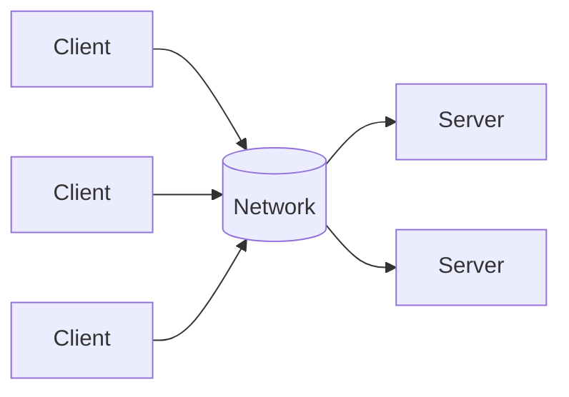

# Distributed Architecture – Simple Guide

## 1. Definition

### Simple Definition
Distributed architecture connects multiple computers (or devices) through a network, working together as one system.

### One‑Line Exam Definition
*“A collection of independent computing devices connected via a network, communicating through message passing or remote calls.”*

---

## 2. Why Do We Need It?

### The Problem It Solves
A single computer has limits – processing power, storage, reliability. If it fails, everything stops.

### Why Was It Created?
To share workload across multiple machines, improve reliability, and handle large‑scale systems.

### What Happens Without It?
Single point of failure, limited scalability, and poor performance for large users.

---

## 3. Real‑World Analogy

**Multiple cashiers in a supermarket** – one cashier is a bottleneck; many cashiers (distributed) serve more customers and if one leaves, others continue.

---

## 4. When to Use It

- Large enterprise systems (banks, e‑commerce).
- Systems needing high availability (no downtime).
- Applications with many concurrent users.
- Big data processing.

---

## 5. Key Terms

| Term | Meaning |
|------|---------|
| **Network topology** | How devices are connected (star, mesh, etc.). |
| **Communication mode** | How they talk (message passing, RPC, RMI). |
| **RPC** | Remote Procedure Call – call a function on another machine. |
| **RMI** | Remote Method Invocation – call a method on remote object. |

---

## 6. Structure / Components

| Component | Purpose |
|-----------|---------|
| **Clients** | Active entities – initiate communication. |
| **Servers** | Reactive entities – respond to requests. |
| **Network** | Connects all devices. |

---

## 7. Diagram

---

## 8. How It Works

1. **Client initiates** request (active).
2. **Network delivers** message to server.
3. **Server processes** request (reactive).
4. **Server sends** response back.
5. **Client receives** and continues.

---

## 9. Real Software Examples

| System | How It Uses Distributed Architecture |
|--------|--------------------------------------|
| **Web browsing** | Browser (client) talks to web server. |
| **Email** | Email client to mail server. |
| **Online gaming** | Many players connect to game servers. |

---

## 10. Categories (covered in next sections)

- Client‑Server
- Multi‑tier
- Service‑Oriented Architecture (SOA)

---

## 11. Advantages

| Advantage | Why It’s Good |
|-----------|---------------|
| **Scalability** | Add more servers for more users. |
| **Reliability** | One failure doesn’t stop whole system. |
| **Resource sharing** | Use many computers’ power together. |

---

## 12. Disadvantages

| Disadvantage | Why It’s Bad |
|--------------|---------------|
| **Complexity** | Network, security, synchronisation harder. |
| **Latency** | Network delays compared to local calls. |
| **Security** | More points to attack. |

---

## 13. Exam Keywords

Distributed, network, client, server, RPC, RMI, message passing, topology.

---

## 14. Viva Questions

| # | Question | Answer |
|---|----------|--------|
| 1 | What is distributed architecture? | Multiple computers connected via network working as one system. |
| 2 | What is a client? | Active entity that initiates communication. |
| 3 | What is a server? | Reactive entity that responds to requests. |
| 4 | Give an example. | Web browser (client) and web server. |

---

## 15. Memory Tip

**“Many computers, one system”** – like many cashiers in a store.

---

## 16. Quick Revision

### Category
Distributed Architecture

### Problem
Single computer has limits in power, storage, reliability.

### Solution
Connect multiple computers via network; they communicate and cooperate.

### Key Components
- Clients (active)
- Servers (reactive)
- Network

### Keywords
Distributed, network, client, server, RPC, RMI.

### One‑Line Summary
**Distributed = many computers working together as one.**

---

<Callout type="info">
  **Next topics:** Client‑Server, Multi‑tier, SOA, and Cloud models (IaaS, PaaS, SaaS).
</Callout>

