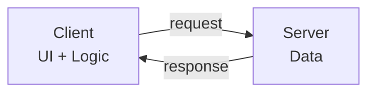
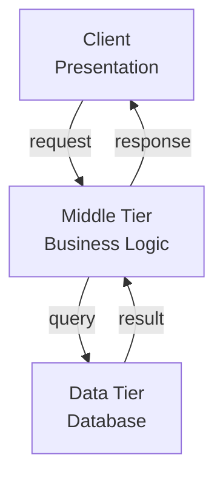

## 1. Definition

### Simple Definition
Multi‑tier architecture organises a system into **separate logical layers** (tiers) – typically presentation, business logic, and data – each running on its own machine or process.

### One‑Line Exam Definition
*“A client‑server extension where presentation, business logic, and data management are separated into different tiers.”*

---

## 2. Why Do We Need It?

### The Problem It Solves
In basic client‑server (2‑tier), the client often contains both UI and business logic – fat client. Changing logic means updating every client.

### Why Was It Created?
To **separate concerns** – each tier has one job. Change one tier without affecting others.

### What Happens Without It?
Business logic duplicated in clients, hard to maintain, and not scalable.

---

## 3. Real‑World Analogy

**Restaurant with waiter** – customer (presentation) orders from waiter (business logic), who tells kitchen (data). Customer never talks to kitchen. If menu changes, only waiter changes – not customers.

---

## 4. When to Use It

- Web applications (browser, app server, database).
- Enterprise systems needing scalability.
- Applications where logic changes frequently.
- Systems requiring security separation (database not exposed to clients).

---

## 5. Key Terms

| Term | Meaning |
|------|---------|
| **Tier** | A physical or logical separation – each runs on its own machine/process. |
| **2‑tier** | Client (UI + logic) + Server (data). Fat client. |
| **3‑tier** | Client (UI) + Middle tier (business logic) + Data tier. |
| **N‑tier** | More than 3 tiers (e.g., caching, messaging, etc.). |
| **Middle tier** | Business logic layer – sits between UI and data. |

---

## 6. Structure / Components

| Tier | Name | Purpose |
|------|------|---------|
| **Tier 1** | Presentation (UI) | User interface – displays data, takes input. |
| **Tier 2** | Business Logic | Processes commands, calculations, decisions. |
| **Tier 3** | Data Management | Stores/retrieves data from database. |

**Rule in 3‑tier:** Presentation and Data tiers do NOT communicate directly – only through business tier.

---

## 7. Diagram

### 2‑Tier (Client‑Server)



### 3‑Tier



**Note:** Client and Data never talk directly.

---

## 8. How It Works (3‑tier)

1. **User interacts** with presentation tier (e.g., web browser).
2. **Presentation sends** request to middle tier (business logic) – e.g., HTTP to app server.
3. **Middle tier** processes – validates, calculates, then asks data tier.
4. **Data tier** returns data (e.g., SQL result).
5. **Middle tier** formats/transforms data.
6. **Presentation tier** displays to user.

---

## 9. Simple Example

```java
// Tier 1: Presentation (Servlet / Controller)
@WebServlet("/login")
public class LoginServlet {
    private UserService service = new UserService(); // middle tier
    
    protected void doPost(HttpServletRequest req, HttpServletResponse resp) {
        String user = req.getParameter("username");
        boolean ok = service.authenticate(user, req.getParameter("pwd"));
        resp.getWriter().write(ok ? "Success" : "Fail");
    }
}

// Tier 2: Business Logic
public class UserService {
    private UserRepository repo = new UserRepository();
    
    public boolean authenticate(String user, String pwd) {
        // Business rules: password hashing, lockout checks, etc.
        User u = repo.findByUsername(user);
        return u != null && u.checkPassword(pwd);
    }
}

// Tier 3: Data Access
public class UserRepository {
    public User findByUsername(String user) {
        // JDBC call to database
        return new User(...);
    }
}
```

**Explanation:** Browser (presentation) calls servlet, servlet calls service (business), service calls repository (data). No direct browser‑database connection.

---

## 10. Real Software Examples

| System | Tier Structure |
|--------|----------------|
| **Spring Boot web app** | Browser (presentation) → Controller/Service (business) → Repository → DB |
| **Online store** | Browser → App server (orders, inventory) → Database |
| **Banking portal** | Browser → Application server (transactions) → Mainframe DB |
| **Old desktop app (2‑tier)** | Desktop app (UI+logic) → Database server |

---

## 11. Advantages (3‑tier vs 2‑tier)

| Advantage | Why It’s Good |
|-----------|---------------|
| **Reusability** | Business tier can serve many UIs (web, mobile, API). |
| **Scalability** | Scale each tier independently (more app servers). |
| **Modifiability** | Change business logic without touching UI or DB. |
| **Security** | Database not exposed directly to clients. |
| **Isolated debugging** | Bug in UI doesn’t mean bug in logic. |

---

## 12. Disadvantages

| Disadvantage | Why It’s Bad |
|--------------|---------------|
| **Heavy network traffic** | More hops between client and data. |
| **Higher latency** | Each tier adds delay. |
| **Complexity** | More moving parts to deploy and manage. |
| **Legacy integration** | Old systems may not fit clean tiers (need adapters). |

---

## 13. How to Identify in Exams

### Exam Keywords

| Keyword | Why It Points to Multi‑tier |
|---------|----------------------------|
| “Presentation, business, data” | The three tiers. |
| “2‑tier vs 3‑tier” | Comparison question. |
| “Middle tier” | Business logic tier. |
| “Tier 1, Tier 2, Tier 3” | Numbered tiers. |
| “Separation of concerns” | Core reason for multi‑tier. |

---

## 14. Comparison – 2‑tier vs 3‑tier

| Aspect | 2‑Tier | 3‑Tier |
|--------|--------|--------|
| **Tiers** | Client + Server | Client + Business + Data |
| **Where is business logic?** | Client (fat client) or server (stored proc) | Middle tier |
| **Scalability** | Limited | High (scale middle tier) |
| **Maintainability** | Lower (logic in clients) | Higher |
| **Security** | DB exposed to client | DB hidden behind middle tier |
| **Example** | Old desktop DB app | Modern web app |

---

## 15. Viva Questions

| # | Question | Answer |
|---|----------|--------|
| 1 | What is 3‑tier architecture? | Presentation, business logic, data tiers – each separate. |
| 2 | How does 3‑tier differ from 2‑tier? | 2‑tier has logic in client; 3‑tier has separate business tier. |
| 3 | Can presentation talk directly to data in 3‑tier? | No – only through business tier. |
| 4 | Give an example of 3‑tier. | Web browser → Spring Controller → Database. |
| 5 | What is a benefit of 3‑tier? | Reusability – same business tier for web and mobile. |
| 6 | What is a disadvantage? | Higher latency (more network hops). |
| 7 | What does “n‑tier” mean? | More than 3 tiers (e.g., caching, message queue layers). |
| 8 | Why is 3‑tier more scalable than 2‑tier? | You can add many middle tier servers independently. |

---

## 16. Memory Tip

**“Presentation asks Business, Business asks Data”** – never skip.

**3‑tier = 3 boxes: UI → Logic → DB**

---

## 17. Quick Revision

### Category
Distributed Architecture (Client‑Server variant)

### Problem
2‑tier client‑server leads to fat clients, hard maintenance.

### Solution
3‑tier: separate UI (tier 1), business logic (tier 2), data (tier 3). Tiers only talk to neighbours.

### Key Components
- Presentation tier
- Business logic (middle) tier
- Data tier

### Advantages
Reusability, scalability, modifiability, security.

### Keywords
2‑tier, 3‑tier, n‑tier, presentation, business logic, data, middle tier.

### One‑Line Exam Definition
*“Architecture separating user interface, business logic, and data management into distinct tiers.”*

### One‑Line Summary
**Multi‑tier = separate UI, logic, database – each on its own machine.**

---

<Callout type="success">
  **Exam Tip:** When asked “why 3‑tier over 2‑tier?” – answer: reusability, scalability, and separation of concerns.
</Callout>