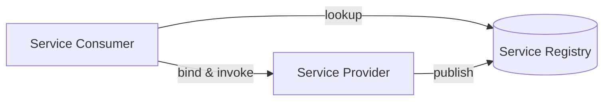

## 1. Definition

### Simple Definition
SOA is an architecture where software is built as a collection of **services** that communicate over a network. Each service does one business task.

### One‑Line Exam Definition
*“An architectural style where independent, reusable services communicate via standard protocols to support business processes.”*

---

## 2. Why Do We Need It?

### The Problem It Solves
Monolithic applications are hard to change, reuse, and integrate with other systems.

### Why Was It Created?
To allow different applications (even from different companies) to work together without rewriting everything.

### What Happens Without It?
Each system has its own way of doing things – integration requires custom code for every pair.

---

## 3. Real‑World Analogy

**Travel booking** – flight service, hotel service, car rental service. A travel agent (or orchestrator) calls each service to build a complete trip. Services are independent; you can change hotel service without affecting flight service.

---

## 4. When to Use It

- Large enterprises with multiple systems (ERP, CRM, billing).
- B2B integration (company to company).
- Reusable business capabilities (e.g., payment service).
- Cloud applications.

---

## 5. Key Terms

| Term | Meaning |
|------|---------|
| **Service** | Self‑contained unit that performs a specific business function. |
| **Provider** | The system that hosts and offers the service. |
| **Consumer** | The client that uses the service. |
| **Contract** | Defines what the service does, input/output, and how to access. |
| **Orchestration** | Combining multiple services into a workflow. |
| **SOAP / REST** | Common communication protocols. |

---

## 6. Structure / Components

| Component | Purpose |
|-----------|---------|
| **Service provider** | Creates and hosts the service. |
| **Service consumer** | Finds and calls the service. |
| **Service registry** | Directory where providers publish services. |
| **Contract** | Formal agreement on inputs, outputs, and protocol. |

---

## 7. Diagram



---

## 8. How It Works

1. **Provider publishes** service to a registry.
2. **Consumer finds** service in registry.
3. **Consumer binds** to service (gets endpoint).
4. **Consumer invokes** service using contract (e.g., SOAP/XML, REST/JSON).
5. **Service executes** and returns response.
6. **Consumer uses** result.

**Key:** Services are loosely coupled – change provider without changing consumer (if contract unchanged).

---

## 9. Simple Example (Conceptual)

```java
// Service Contract (interface)
public interface PaymentService {
    PaymentResponse charge(PaymentRequest request);
}

// Provider implementation (on server)
public class PaymentServiceImpl implements PaymentService {
    public PaymentResponse charge(PaymentRequest req) {
        // process credit card
        return new PaymentResponse("success", "txn123");
    }
}

// Consumer code (on another server)
public class OrderService {
    private PaymentService payment = lookup("PaymentService");
    
    public void checkout(Order order) {
        PaymentResponse resp = payment.charge(order.getPayment());
        // ...
    }
}
```

**Explanation:** Consumer uses `PaymentService` interface without knowing which server or implementation runs it.

---

## 10. Real Software Examples

| System | SOA Example |
|--------|-------------|
| **Amazon e‑commerce** | Product service, order service, payment service, shipping service. |
| **PayPal API** | Payment service consumed by thousands of merchants. |
| **Weather API** | Service that returns weather data. |
| **Enterprise ESB** | Message routing between legacy systems. |

---

## 11. Advantages

| Advantage | Why It’s Good |
|-----------|---------------|
| **Reusability** | Same service used by many applications. |
| **Loose coupling** | Change service internally without breaking consumers. |
| **Interoperability** | Services from different platforms (Java, .NET) can talk. |
| **Business alignment** | Services match business capabilities. |

---

## 12. Disadvantages

| Disadvantage | Why It’s Bad |
|--------------|---------------|
| **Complexity** | More moving parts – registry, contracts, security. |
| **Performance overhead** | Network calls, XML/JSON parsing slower than local calls. |
| **Versioning challenges** | Changing contract may break all consumers. |
| **Testing difficulty** | Integration testing across services. |

---

## 13. How to Identify in Exams

### Exam Keywords

| Keyword | Why It Points to SOA |
|---------|----------------------|
| “Service” / “Reusable service” | Core term. |
| “Publish, find, bind” | SOA lifecycle. |
| “Loose coupling” | Main benefit. |
| “Orchestration” | Combining services. |
| “B2B integration” | Common use case. |

---

## 14. Comparison – SOA vs Monolith

| Aspect | SOA | Monolith |
|--------|-----|----------|
| **Deployment** | Services deployed independently | Whole app together |
| **Scaling** | Scale only busy services | Scale entire app |
| **Technology** | Services can use different stacks | One technology stack |
| **Communication** | Network calls (slower) | In‑memory calls (fast) |

---

## 15. Viva Questions

| # | Question | Answer |
|---|----------|--------|
| 1 | What is SOA? | Architecture of reusable services communicating over a network. |
| 2 | Name the three roles in SOA. | Service provider, service consumer, service registry. |
| 3 | What is a service contract? | Defines what the service does, inputs, outputs, and access method. |
| 4 | Give an example of a service. | Payment service, weather service, shipping service. |
| 5 | Is SOA the same as microservices? | No – microservices are a refined, more decentralised evolution of SOA. |
| 6 | What is orchestration? | Combining multiple services into a workflow. |
| 7 | What protocol is common in SOA? | SOAP (older) or REST (modern). |
| 8 | What is a disadvantage of SOA? | Performance overhead of network calls. |

---

## 16. Memory Tip

**“Publish, Find, Bind”** – three actions of SOA.

**SOA = Lego blocks for business functions.**

---

## 17. Quick Revision

### Category
Distributed Architecture

### Problem
Monolithic apps hard to integrate and reuse.

### Solution
Break into independent services with standard contracts. Services publish, consumers find and bind.

### Key Components
- Service provider
- Service consumer
- Service registry
- Contract

### Advantages
Reusability, loose coupling, interoperability.

### Keywords
Service, SOA, publish‑find‑bind, contract, orchestration, loose coupling.

### One‑Line Exam Definition
*“An architecture where reusable services communicate via standard contracts.”*

### One‑Line Summary
**SOA = independent business services calling each other over network.**

---

<Callout type="info">
  **Next:** Cloud service models – IaaS, PaaS, SaaS.
</Callout>