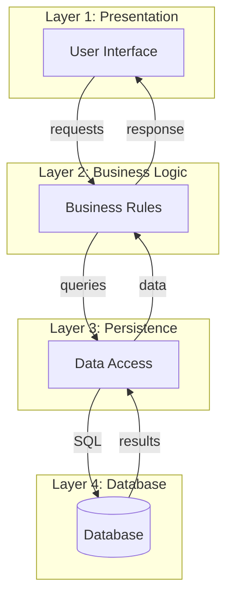
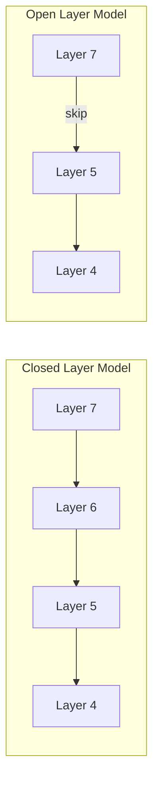

# Layered Architecture – Simple Guide

## 1. Definition

### Simple Definition
Layered architecture organises software into **horizontal layers** – each layer provides services to the layer above and uses services from the layer below.

### One‑Line Exam Definition
*“A hierarchical style where software is divided into ordered layers; each layer only communicates with adjacent layers.”*

---

## 2. Why Do We Need It?

### The Problem It Solves
Without layers, all code (UI, business logic, database) is mixed together – hard to change, test, or reuse. Changing the database affects the UI.

### Why Was It Created?
To separate **concerns** – each layer has a specific job. You can change one layer without touching others.

### What Happens Without It?
Tightly coupled “big ball of mud” – a database change breaks the UI, business logic is duplicated everywhere.

---

## 3. Real‑World Analogy

**Hotel** – floors are layers. Guest (top floor) calls room service (middle floor), who calls kitchen (bottom floor). Guest never calls kitchen directly. Each floor talks only to the floor below.

---

## 4. When to Use It

- Business applications (web apps, desktop apps).
- Systems with clear separation: presentation → business → data.
- When you need portability (change database without changing UI).
- When multiple teams work on different layers.

---

## 5. Key Terms

| Term | Meaning |
|------|---------|
| **Layer** | A set of modules providing related services. |
| **Closed layer** | Layer can only talk to the layer directly below (strict). |
| **Open layer** | Layer can skip layers (talk to any lower layer). |
| **Up interface** | Services provided to the layer above. |
| **Down interface** | Services required from the layer below. |
| **Bridge** | Allowed connection from an upper layer to a lower layer (not adjacent). |
| **Breach** | Lower layer calling a higher layer (usually not allowed). |

---

## 6. Structure / Components

| Component | Purpose |
|-----------|---------|
| **Presentation layer** | User interface – takes input, shows output. |
| **Business layer** | Core logic – rules, calculations, validations. |
| **Persistence layer** | Data access – reads/writes to database. |
| **Database layer** | Actual database (often counted as layer 4). |

Each layer has **up interface** (services it provides) and **down interface** (services it needs).

**Rule (closed):** Layer N only talks to layer N-1. No skipping.

---

## 7. Diagram

### Basic Layered Architecture



### Closed vs Open (OSI Example)



**Closed:** adjacent only. **Open:** can skip.

---

## 8. How It Works

1. **User interacts** with presentation layer (e.g., clicks button).
2. **Presentation calls** business layer (never directly calls database).
3. **Business layer** applies rules, then calls persistence layer.
4. **Persistence layer** translates requests to database queries.
5. **Database returns** data to persistence.
6. **Persistence passes** data up to business.
7. **Business processes** data, returns result to presentation.
8. **Presentation displays** result to user.

**If closed (strict):** Each layer only talks to layer directly below.  
**If open:** Upper layer can skip intermediate layers (faster but less maintainable).

**Bridge:** Special case – upper layer connects to a layer more than one level down (acceptable sometimes).  
**Breach:** Lower layer calls upper layer – usually forbidden.

---

## 9. Simple Example

```java
// Presentation Layer (e.g., Servlet/Controller)
public class UserController {
    private UserService service = new UserService();
    
    public String getUserName(int id) {
        return service.findUserById(id).getName();
    }
}

// Business Layer
public class UserService {
    private UserRepository repo = new UserRepository();
    
    public User findUserById(int id) {
        // Apply business rules (e.g., caching, validation)
        return repo.findById(id);
    }
}

// Persistence Layer
public class UserRepository {
    public User findById(int id) {
        // Database query (simulated)
        return new User(id, "John Doe");
    }
}
```

**Explanation:** Controller → Service → Repository. Each only knows the layer below.

---

## 10. Real Software Examples

| System | How It Uses Layered Architecture |
|--------|----------------------------------|
| **Spring Boot web apps** | Controller → Service → Repository. |
| **OSI network model** | 7 closed layers (physical to application). |
| **TCP/IP stack** | 4 layers (application, transport, internet, network). |
| **Java Swing with MVC** | View (presentation), Controller (business), Model (data). |
| **Enterprise ERP systems** | UI layer, business logic layer, database layer. |

---

## 11. Advantages

| Advantage | Why It’s Good |
|-----------|---------------|
| **Separation of concerns** | Each layer has one job. |
| **Portability** | Change database – only persistence layer changes. |
| **Reusability** | Business layer can be reused with different UIs. |
| **Incremental development** | Build one layer at a time. |
| **Team friendly** | Different teams can work on different layers. |

---

## 12. Disadvantages

| Disadvantage | Why It’s Bad |
|--------------|---------------|
| **Lower performance** | Each layer adds overhead (marshalling, buffering). |
| **Difficulty with exceptions** | Error must pass through all layers. |
| **Not suitable for all apps** | Simple apps don’t need many layers. |
| **Bridge may cause tight coupling** | Skipping layers defeats purpose. |
| **Deadlock risk** | Circular dependencies if layers call each other. |

---

## 13. How to Identify in Exams

### Exam Keywords

| Keyword | Why It Points to Layered Architecture |
|---------|----------------------------------------|
| “Presentation, business, persistence” | Classic three‑layer model. |
| “Layer only talks to adjacent layer” | Closed layer rule. |
| “Up interface / down interface” | Layer interfaces. |
| “OSI model” / “TCP/IP stack” | Network examples. |
| “Portability” / “Separation of concerns” | Key benefits. |

---

## 14. Comparison – Closed vs Open Layers

| Aspect | Closed Layer | Open Layer |
|--------|--------------|------------|
| **Communication** | Only adjacent layers | Can skip layers |
| **Maintainability** | High – changes isolated | Lower – skips create dependencies |
| **Performance** | Lower – more steps | Higher – fewer steps |
| **Example** | OSI protocol stack | Some business apps (efficiency priority) |

---

## 15. Viva Questions

| # | Question | Answer |
|---|----------|--------|
| 1 | What is layered architecture? | Software divided into ordered layers; each layer provides services to layer above. |
| 2 | Name the three common layers. | Presentation, business, persistence. |
| 3 | What is a closed layer? | Layer can only talk to the layer directly below. |
| 4 | What is an open layer? | Layer can skip layers below for efficiency. |
| 5 | Give an example of closed layers. | OSI 7‑layer model. |
| 6 | What is a bridge in layered architecture? | Upper layer connecting to a layer more than one level down. |
| 7 | What is a breach? | Lower layer calling a higher layer – usually not allowed. |
| 8 | Why is layered architecture portable? | Change database – only persistence layer changes; UI unaffected. |
| 9 | What is a disadvantage of many layers? | Performance overhead from data marshalling. |
| 10 | How does layered architecture support teams? | Each team owns a layer; they agree on interfaces. |

---

## 16. Memory Tip

**“Presentation‑Business‑Persistence” (PBP)** – think of a sandwich: Presentation (top bread), Business (meat), Persistence (bottom bread). Database below.

**Closed = strict neighbour only. Open = skip.**

---

## 17. Quick Revision

### Category
Hierarchical Architecture

### Problem
Mixed code (UI + logic + database) is hard to maintain, test, and reuse.

### Solution
Organise into layers. Each layer has a clear responsibility. Adjacent layer communication only (closed) or optional skipping (open).

### Key Components
- Presentation layer
- Business layer
- Persistence layer
- Up/down interfaces

### Advantages
Separation of concerns, portability, reusability, incremental development.

### Keywords
Layer, closed, open, up interface, down interface, bridge, breach, OSI.

### One‑Line Exam Definition
*“An ordered hierarchy of layers where each layer provides services to the layer above and uses services from the layer below.”*

### One‑Line Summary
**Layered Architecture = stack of responsibilities – each layer only talks to neighbours.**

---

<Callout type="info">
  **Exam Tip:** Remember the hotel analogy. And know the difference between closed (strict) and open (skip) layers – closed is maintainable, open is faster.
</Callout>