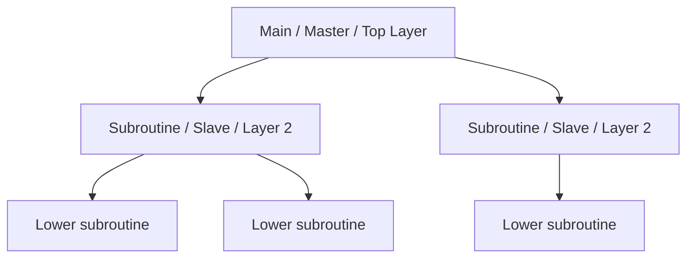

## Definition
A style where software is **decomposed into logical modules at different levels**. Lower levels provide specific services to upper levels. Communication is usually **call‑and‑return** (explicit method invocation).

---

## Four Sub‑styles (from slides)

| Sub‑style | Key Idea |
|-----------|----------|
| **Main‑Subroutine** | Main program calls subroutines; subroutines can call lower ones. Tree of calls. |
| **Master‑Slave** | Master distributes work to replicated slaves. Fault tolerance + parallelism. |
| **Layered** | Ordered layers; each layer talks only to adjacent layer (closed) or may skip (open). |
| **Virtual Machine** | Extra layer between software and hardware (JVM, hypervisor). Provides portability/isolation. |

---

## Diagram – Hierarchy Tree

---

## How It Works (General)

1. **Top‑level** component controls overall flow.
2. **Requests go downward** – higher level asks lower level for service.
3. **Lower level** performs task and returns result.
4. **May continue** down multiple levels.

---

## Real Examples

- **Main‑Subroutine:** C program with main() calling functions.
- **Master‑Slave:** MySQL replication, Hadoop MapReduce.
- **Layered:** Spring Boot (Controller → Service → Repository).
- **Virtual Machine:** Java JVM, VirtualBox.

---

## Advantages (General)

- Simple to understand (tree structure)
- Reuse of lower‑level modules
- Stepwise refinement (top‑down design)

## Disadvantages (General)

- Tight coupling – change in lower level may affect upper levels (ripple effect)
- Not all problems fit a strict hierarchy
- Lower performance if too many levels

---

## One‑Line Summary

**Hierarchical = tree of modules – higher calls lower, services flow up.**

<Callout type="info">
  **Exam Tip:** For a specific sub‑style (layered, master‑slave, etc.), refer to the detailed notes. This page gives the big picture of the “Hierarchical” family.
</Callout>