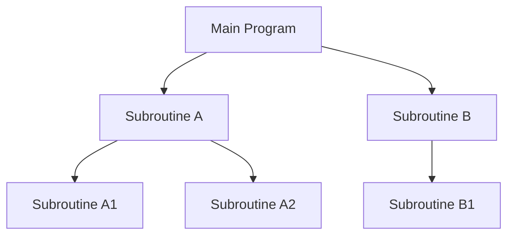

## 1. Definition

### Simple Definition
Main‑subroutine architecture is a hierarchical style where a **main program** calls **subroutines** (functions/procedures) to perform tasks. Subroutines can call other subroutines, forming a tree of calls.

### One‑Line Exam Definition
*“A call‑and‑return hierarchical style where a main module controls execution and delegates work to subroutines.”*

---

## 2. Why Do We Need It?

### The Problem It Solves
Without structure, code becomes a **big mess** – everything in one long block. Hard to reuse, test, or understand.

### Why Was It Created?
To break large programs into **smaller, reusable pieces** (subroutines). Each subroutine does one job. The main program coordinates.

### What Happens Without It?
Spaghetti code – no clear flow, repeated logic, hard to debug.

---

## 3. Real‑World Analogy

**Restaurant chef (main)** calls **specialists** – chopping vegetables, grilling meat, plating. Each specialist does one task and reports back. The chef decides the order.

---

## 4. When to Use It

- Procedural programming (C, Pascal, Fortran).
- Simple scripts that need modularisation.
- Legacy systems maintenance.
- As a subsystem inside object‑oriented design.

---

## 5. Key Terms

| Term | Meaning |
|------|---------|
| **Main program** | Starting point; controls overall flow. |
| **Subroutine** | Reusable block of code that performs a specific task. |
| **Call‑and‑return** | Main calls subroutine; subroutine returns control when done. |
| **Pass by value** | Copy of data passed – original unchanged. |
| **Pass by reference** | Address passed – original can be modified. |

---

## 6. Structure / Components

| Component | Purpose |
|-----------|---------|
| **Main program** | Entry point; calls subroutines in order. |
| **Subroutines** | Independent functions that do one task. Can call other subroutines. |
| **Parameters** | Data passed between main and subroutines. |
| **Return value** | Data sent back to caller. |

**Hierarchy:** Main at top → subroutines at level 2 → sub‑subroutines at level 3 (tree structure).

---

## 7. Diagram



Control flows down, returns back up.

---

## 8. How It Works

1. **Program starts** at the main function.
2. **Main calls** a subroutine – passes data (by value or reference).
3. **Subroutine executes** its task – may call lower‑level subroutines.
4. **Subroutine returns** control (and optionally a result) to its caller.
5. **Main continues** – may call more subroutines.
6. **Program ends** when main finishes.

**Key:** Lower levels provide services to higher levels. No skipping.

---

## 9. Simple Example

```java
// Main program
public class Main {
    public static void main(String[] args) {
        int a = 10, b = 5;
        int sum = add(a, b);        // call subroutine
        int product = multiply(a, b);
        System.out.println("Sum: " + sum + ", Product: " + product);
    }
    
    // Subroutine 1
    public static int add(int x, int y) {
        return x + y;   // returns to caller
    }
    
    // Subroutine 2
    public static int multiply(int x, int y) {
        return x * y;
    }
}
```

**Explanation:** `main` calls `add` and `multiply` – each does one job and returns. Classic main‑subroutine.

---

## 10. Real Software Examples

| System | How It Uses Main‑Subroutine |
|--------|----------------------------|
| **C programs** | `main()` function calls other functions. |
| **Shell scripts** | Main script calls functions or other scripts. |
| **Legacy Fortran/Cobol systems** | Batch processing with main routine calling subroutines. |
| **Embedded systems** | Main loop calls sensor reading, processing, output routines. |

---

## 11. Advantages

| Advantage | Why It’s Good |
|-----------|---------------|
| **Simple to understand** | Clear tree‑like flow. |
| **Reusability** | Subroutines can be called from many places. |
| **Easy to test** | Each subroutine can be tested independently. |
| **Top‑down development** | Design main first, then refine subroutines. |

---

## 12. Disadvantages

| Disadvantage | Why It’s Bad |
|--------------|---------------|
| **Global data vulnerability** | Shared data (global variables) can be changed by any subroutine – hard to debug. |
| **Tight coupling** | Changing a subroutine’s signature breaks all callers. |
| **Ripple effect** | A change in a low‑level subroutine may affect many higher‑level ones. |
| **Not object‑oriented** | Does not encapsulate data with behaviour. |

---

## 13. How to Identify in Exams

### Exam Keywords

| Keyword | Why It Points to Main‑Subroutine |
|---------|----------------------------------|
| “Call‑and‑return” | Core mechanism. |
| “Main program calls subroutines” | Direct definition. |
| “Hierarchical refinement” | Top‑down decomposition. |
| “Pass by value / reference” | Parameter passing methods. |
| “Procedural programming” | Typical domain. |

---

## 14. Comparison – Main‑Subroutine vs Object‑Oriented

| Aspect | Main‑Subroutine | Object‑Oriented |
|--------|------------------|------------------|
| **Data** | Global or passed | Encapsulated in objects |
| **Coupling** | Often tight | Looser via interfaces |
| **Reuse** | Function‑level | Class‑level |
| **Change impact** | High (ripple effect) | Lower (polymorphism) |

---

## 15. Viva Questions

| # | Question | Answer |
|---|----------|--------|
| 1 | What is main‑subroutine architecture? | A main program calls subroutines in a hierarchical tree. |
| 2 | Give an example of pass by value. | Java primitive arguments – a copy is passed. |
| 3 | Give an example of pass by reference. | Arrays or objects in Java (reference copy). |
| 4 | What is a major disadvantage? | Global data can be corrupted by any subroutine. |
| 5 | Is main‑subroutine still used? | Yes – in C, procedural code, and as part of larger designs. |
| 6 | What does “ripple effect” mean? | A change in one subroutine affects many callers. |
| 7 | How is data shared in main‑subroutine? | Through global variables or parameters. |
| 8 | Name a real system that uses it. | A simple C calculator program. |
| 9 | What is the benefit of top‑down refinement? | You design high‑level flow first, then details. |
| 10 | Can main‑subroutine be used in OOP? | Yes – methods calling other methods is essentially same idea. |

---

## 16. Memory Tip

**“Main calls, subs return”** – imagine a manager (main) delegating tasks to workers (subroutines). Workers report back.

---

## 17. Quick Revision

### Category
Hierarchical Architecture

### Problem
Large programs are messy and unreusable.

### Solution
Break into main + subroutines. Main controls flow; subroutines do specific tasks.

### Key Components
- Main program
- Subroutines
- Parameters / return values

### Advantages
Simple, reusable, testable, top‑down.

### Keywords
Main, subroutine, call‑and‑return, pass by value, pass by reference, procedural.

### One‑Line Exam Definition
*“A hierarchical style where a main program calls subroutines which may call lower‑level subroutines.”*

### One‑Line Summary
**Main‑Subroutine = manager + workers, call‑and‑return.**

---

<Callout type="info">
  **Exam Tip:** When comparing with OOP, highlight that main‑subroutine lacks encapsulation – data is openly shared.
</Callout>