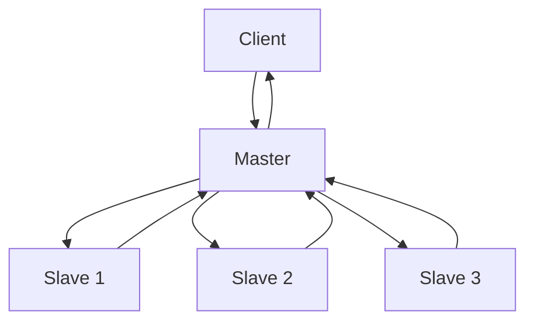
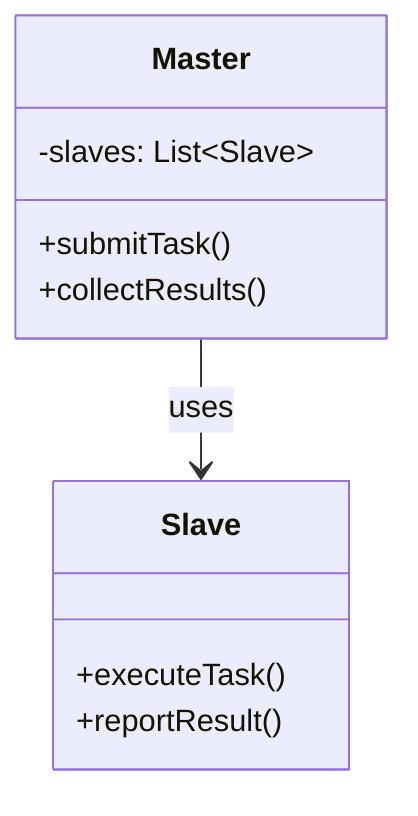

## 1. Definition

### Simple Definition
Master‑slave architecture has one **master** component that controls multiple identical **slave** components. The master assigns tasks to slaves, and slaves report back results.

### One‑Line Exam Definition
*“A fault‑tolerant hierarchical style where a master distributes work to replicated slaves and coordinates their responses.”*

---

## 2. Why Do We Need It?

### The Problem It Solves
A single component doing all work is a **single point of failure**. If it crashes, the whole system stops. Also, one machine may be too slow for heavy tasks.

### Why Was It Created?
To provide **reliability** and **parallel processing**. By replicating slaves, the system keeps working even if some slaves fail. By splitting work among slaves, tasks finish faster.

### What Happens Without It?
A server crash means no service. A slow single processor becomes a bottleneck.

---

## 3. Real‑World Analogy

**Restaurant head chef (master)** and multiple line cooks (slaves). The head chef divides orders among cooks. If one cook is sick, others continue. Work gets done in parallel.

---

## 4. When to Use It

- **Fault‑tolerant systems** – one slave fails, others take over.
- **Parallel computation** – large task split among many slaves.
- **Database replication** – master receives writes, slaves handle reads.
- **Load balancing** – master distributes requests to worker servers.

---

## 5. Key Terms

| Term | Meaning |
|------|---------|
| **Master** | Controls the work, assigns tasks, collects results. |
| **Slave** | Replicated worker that performs a subtask. |
| **Replication** | Having multiple identical slaves. |
| **Fault tolerance** | System continues even if some slaves fail. |
| **Redundancy** | Extra components that can replace failed ones. |

---

## 6. Structure / Components

| Component | Purpose |
|-----------|---------|
| **Master** | Receives request, splits into subtasks, sends to slaves, collects/combines results. Also monitors slave health. |
| **Slaves** | Perform the actual computation or service. Multiple identical copies. |
| **Communication** | Master‑slave messages (e.g., task assignment, result return, heartbeat). |

**Note:** Slaves do not talk to each other – only to master.

---

## 7. Diagram



**UML Class Diagram (from slides)**



---

## 8. How It Works

1. **Client sends request** to master.
2. **Master splits** the task into smaller subtasks.
3. **Master assigns** each subtask to an available slave.
4. **Each slave executes** its subtask independently (possibly in parallel).
5. **Slaves return** results to master.
6. **Master combines** results into final answer.
7. **Master sends** final answer to client.
8. **If a slave fails**, master reassigns its work to another slave.

**Parallel example:** Master splits a large array sum into chunks; each slave sums its chunk; master adds chunk sums.

---

## 9. Simple Example

```java
// Master
public class Master {
    private List<Slave> slaves;
    
    public int sumArray(int[] data) {
        int chunkSize = data.length / slaves.size();
        List<Future<Integer>> futures = new ArrayList<>();
        
        // Assign chunks to slaves
        for (int i = 0; i < slaves.size(); i++) {
            int start = i * chunkSize;
            int end = (i == slaves.size()-1) ? data.length : start + chunkSize;
            futures.add(slaves.get(i).computeAsync(data, start, end));
        }
        
        // Collect and combine results
        int total = 0;
        for (Future<Integer> f : futures) {
            total += f.get();
        }
        return total;
    }
}

// Slave
public class Slave {
    public int computeChunk(int[] data, int start, int end) {
        int sum = 0;
        for (int i = start; i < end; i++) sum += data[i];
        return sum;
    }
}
```

**Explanation:** Master splits work among slaves, then combines partial sums.

---

## 10. Real Software Examples

| System | How It Uses Master‑Slave |
|--------|--------------------------|
| **Database replication (MySQL master‑slave)** | Master handles writes; slaves handle reads. |
| **Hadoop MapReduce** | Master (JobTracker) assigns map/reduce tasks to slaves (TaskTrackers). |
| **Redis replication** | Master for writes, read‑only replicas for scaling queries. |
| **Load balancer + web servers** | Load balancer (master) distributes HTTP requests to server pool (slaves). |
| **Parallel computing (MPI)** | One master process coordinates many worker processes. |

---

## 11. Advantages

| Advantage | Why It’s Good |
|-----------|---------------|
| **Fault tolerance** | Slave fails – master uses other slaves. |
| **Parallel processing** | Work split among slaves → faster. |
| **Scalability** | Add more slaves to handle more load. |
| **Reliability** | Redundancy means no single point of failure (except master – but master can also be replicated). |

---

## 12. Disadvantages

| Disadvantage | Why It’s Bad |
|--------------|---------------|
| **Master becomes bottleneck** | All communication goes through master. |
| **Master single point of failure** | If master crashes, system stops (unless master is also replicated). |
| **Slave coordination overhead** | Master must wait for all slaves, handle stragglers. |
| **Complexity** | Handling partial failures, retries, and result aggregation adds code. |

---

## 13. How to Identify in Exams

### Exam Keywords

| Keyword | Why It Points to Master‑Slave |
|---------|------------------------------|
| “Fault tolerance” / “Redundancy” | Core reason for master‑slave. |
| “Master assigns work to workers” | Direct description. |
| “Replicated slaves” | Key structural element. |
| “Parallel computation” | Common use case. |
| “Database replication” | Classic example. |

---

## 14. Comparison – Master‑Slave vs Main‑Subroutine

| Aspect | Master‑Slave | Main‑Subroutine |
|--------|--------------|------------------|
| **Communication** | Master to multiple slaves | Main to subroutines |
| **Concurrency** | Slaves can run in parallel | Subroutines run sequentially |
| **Fault tolerance** | Yes – if slave fails | No – subroutine failure crashes program |
| **Replication** | Slaves are identical copies | Subroutines are unique |
| **Typical use** | Distributed systems, databases | Single‑program procedural code |

---

## 15. Viva Questions

| # | Question | Answer |
|---|----------|--------|
| 1 | What is master‑slave architecture? | Master controls replicated slaves that do the actual work. |
| 2 | Give a real example. | MySQL master‑slave replication. |
| 3 | What problem does it solve? | Fault tolerance and parallel processing. |
| 4 | What happens if a slave fails? | Master reassigns its work to another slave. |
| 5 | What is a disadvantage? | Master can become a bottleneck or single point of failure. |
| 6 | How does it achieve fault tolerance? | Through replication – multiple identical slaves. |
| 7 | Can slaves talk to each other? | Typically no – only to master. |
| 8 | Name a parallel computing framework that uses it. | Hadoop MapReduce. |
| 9 | How does master‑slave help with scalability? | Add more slaves to handle more work. |
| 10 | How do you prevent master from being a single point of failure? | Replicate the master (master‑master or failover). |

---

## 16. Memory Tip

**“Master gives orders, slaves execute”** – think of a project manager (master) and many developers (slaves). Manager splits tasks, developers work in parallel, manager collects results.

---

## 17. Quick Revision

### Category
Hierarchical Architecture

### Problem
Single component lacks fault tolerance and parallel processing power.

### Solution
Master controls replicated slaves. Master splits work, slaves execute in parallel, master combines results.

### Key Components
- Master (coordinator)
- Slaves (workers)
- Communication links

### Advantages
Fault tolerance, parallel processing, scalability, reliability.

### Keywords
Master, slave, replication, fault tolerance, parallel, redundancy.

### One‑Line Exam Definition
*“A fault‑tolerant style where a master distributes tasks to multiple replicated slaves.”*

### One‑Line Summary
**Master‑Slave = one boss, many identical workers, work in parallel.**

---

<Callout type="success">
  **Exam Tip:** When asked for applications, mention database replication (MySQL master‑slave) and parallel computing (MapReduce).
</Callout>