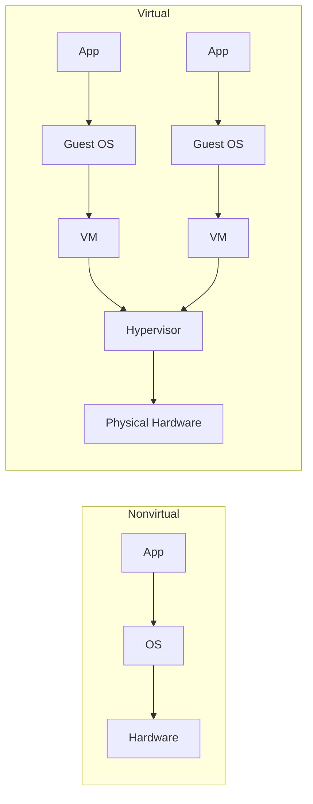
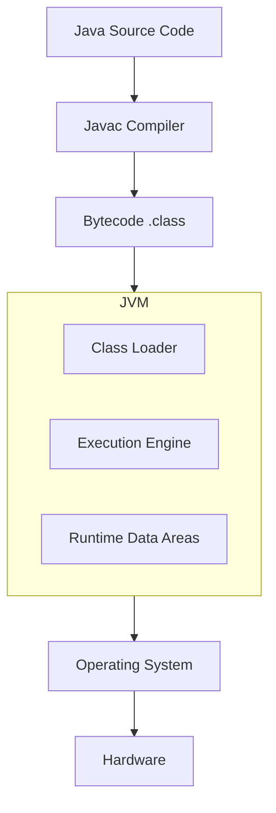

## 1. Definition

### Simple Definition
Virtual Machine (VM) architecture adds a **layer of abstraction** between software and hardware – a VM emulates a physical machine, allowing programs to run on different platforms without change.

### One‑Line Exam Definition
*“A software implementation of a machine that executes programs like a physical machine, providing platform independence and isolation.”*

---

## 2. Why Do We Need It?

### The Problem It Solves
Software written for one operating system or hardware cannot run on another – recompile or rewrite. Also, running multiple OS on one machine is hard.

### Why Was It Created?
To achieve **portability** (write once, run anywhere) and **isolation** (run multiple OS safely on same hardware).

### What Happens Without It?
Each app is tied to one platform – expensive to port. Servers run one OS – underused hardware.

---

## 3. Real‑World Analogy

**Universal power adapter** – same plug works in different countries because the adapter (VM) converts the local electricity to what the device expects. Device doesn’t know which country it’s in.

---

## 4. When to Use It

- **Cross‑platform apps** – Java, .NET applications.
- **Server consolidation** – run many virtual servers on one physical machine.
- **Isolated environments** – test untrusted software safely.
- **Disaster recovery** – VM snapshots for backup and restore.
- **Legacy system emulation** – run old OS on new hardware.

---

## 5. Key Terms

| Term | Meaning |
|------|---------|
| **Virtual Machine (VM)** | Software that emulates a physical computer. |
| **Hypervisor** | Software that creates and runs VMs on physical hardware. |
| **Host** | Physical machine running the hypervisor. |
| **Guest** | Operating system running inside a VM. |
| **JVM (Java Virtual Machine)** | VM that executes Java bytecode. |
| **CLR (Common Language Runtime)** | .NET’s VM for C#, VB.NET, etc. |
| **Interpreter** | Executes bytecode one instruction at a time. |

---

## 6. Structure / Components

| Component | Purpose |
|-----------|---------|
| **Physical hardware** | Real CPU, memory, disk. |
| **Hypervisor / VM monitor** | Manages VMs, allocates resources, isolates guests. |
| **Virtual Machine** | Emulated hardware for a guest OS. |
| **Guest OS** | Operating system running inside VM. |
| **Application** | Runs on guest OS or directly on VM (e.g., Java app on JVM). |

**Two types:**
- **System VM** – runs entire OS (VMware, VirtualBox).
- **Process VM** – runs a single program (JVM, CLR).

---

## 7. Diagram

### Virtual Machine Architecture (Nonvirtual vs Virtual) – from slides



### Java Virtual Machine (JVM) Architecture



---

## 8. How It Works

**For system VM (e.g., VirtualBox):**

1. **Hypervisor installed** on physical hardware (host).
2. **Hypervisor creates VMs** – each VM gets virtual CPU, memory, disk.
3. **Guest OS installed** inside each VM – thinks it owns real hardware.
4. **Hypervisor translates** guest OS instructions to real hardware instructions.
5. **Multiple VMs run** isolated from each other on same host.

**For process VM (e.g., JVM):**

1. **Compiler** converts source code to bytecode (platform‑independent).
2. **JVM loads** bytecode and interprets or JIT‑compiles it.
3. **JVM translates** bytecode to native machine code for current platform.
4. **Program runs** – same bytecode runs on Windows, Linux, macOS.

---

## 9. Simple Example

### Java (JVM) – Write Once, Run Anywhere

```java
// Hello.java – compiled to bytecode
public class Hello {
    public static void main(String[] args) {
        System.out.println("Hello, World!");
    }
}
```

**Compile:** `javac Hello.java` → `Hello.class` (bytecode)  
**Run on any platform:** `java Hello` – JVM translates bytecode to native machine instructions.

### .NET CLR – Similar

```csharp
// C# source → compiles to IL (Intermediate Language) → CLR runs it
using System;
class Program {
    static void Main() {
        Console.WriteLine("Hello, .NET");
    }
}
```

**JIT compilation:** Just‑in‑Time compiler translates bytecode to native code at runtime.

---

## 10. Real Software Examples

| System | How It Uses Virtual Machine |
|--------|----------------------------|
| **Java platform (JVM)** | Runs Java bytecode on any OS. |
| **.NET framework (CLR)** | Runs C#, VB.NET, F# on Windows/Linux/macOS. |
| **VMware / VirtualBox** | Run multiple guest OS on one physical server. |
| **Docker (container)** | Lightweight OS‑level virtualization. |
| **Android Dalvik / ART** | Runs Dalvik bytecode on Android devices. |

---

## 11. Advantages

| Advantage | Why It’s Good |
|-----------|---------------|
| **Portability** | Same bytecode runs anywhere (Java: WORA). |
| **Isolation** | VMs don’t interfere – secure for testing malware. |
| **Hardware independence** | Apps don’t depend on specific CPU or OS. |
| **Server consolidation** | Many VMs on one machine saves power and space. |
| **Disaster recovery** | VM snapshots can be backed up and restored quickly. |

---

## 12. Disadvantages

| Disadvantage | Why It’s Bad |
|--------------|---------------|
| **Performance overhead** | Interpreting bytecode is slower than native execution. |
| **Additional layer** | Extra software (hypervisor/JVM) consumes resources. |
| **Resource sharing** | VMs compete for real hardware – can slow each other. |
| **Virtualization overhead** | Some instructions require translation (e.g., I/O). |

---

## 13. How to Identify in Exams

### Exam Keywords

| Keyword | Why It Points to VM Architecture |
|---------|----------------------------------|
| “Write once, run anywhere” | Java’s promise – JVM. |
| “Bytecode” / “Intermediate language” | JVM and CLR. |
| “Hypervisor” | System VM (VirtualBox, VMware). |
| “Virtualization” | Core concept. |
| “Host and guest” | VM terminology. |
| “JIT compilation” | Just‑in‑Time compilation in JVM/CLR. |

---

## 14. Comparison – JVM vs CLR vs System VM

| Aspect | JVM | .NET CLR | System VM (VirtualBox) |
|--------|-----|----------|------------------------|
| **Type** | Process VM | Process VM | System VM |
| **What it runs** | Java bytecode | CIL (Common IL) | Entire OS (Windows, Linux) |
| **Isolation** | Between Java apps | Between .NET apps | Between complete OS instances |
| **Overhead** | Moderate | Moderate | Higher |
| **Example** | Any Java app | Any C# app | Running Linux on Windows |

---

## 15. Viva Questions

| # | Question | Answer |
|---|----------|--------|
| 1 | What is a virtual machine? | Software emulation of a physical computer. |
| 2 | Name two types of VMs. | System VM (VMware) and process VM (JVM). |
| 3 | What does JVM stand for? | Java Virtual Machine. |
| 4 | What is the benefit of JVM? | Portability – same bytecode runs on any OS. |
| 5 | What is a hypervisor? | Software that creates and manages VMs on physical hardware. |
| 6 | What is JIT compilation? | Just‑in‑Time compilation – bytecode to native code at runtime. |
| 7 | Give an example of a system VM product. | VMware, VirtualBox, Hyper‑V. |
| 8 | What is a disadvantage of VM architecture? | Performance overhead (slower than native execution). |
| 9 | What is the difference between host and guest? | Host = physical machine; guest = OS running inside VM. |
| 10 | How does VM help with disaster recovery? | VM snapshots can be backed up and restored easily. |

---

## 16. Memory Tip

**“JVM = Java’s magic translator”** – writes once, runs anywhere because JVM translates bytecode to local machine code.

**VirtualBox = “one computer, many computers inside.”**

---

## 17. Quick Revision

### Category
Hierarchical Architecture

### Problem
Software not portable across platforms; hardware underused.

### Solution
Add VM layer between software and hardware. VM emulates machine, translates instructions.

### Key Components
- Physical hardware
- Hypervisor (or VM itself)
- Virtual machines (guest OS)
- Bytecode / intermediate language

### Advantages
Portability, isolation, server consolidation, disaster recovery.

### Keywords
VM, JVM, CLR, hypervisor, bytecode, host, guest, JIT, virtualization.

### One‑Line Exam Definition
*“A software layer that emulates a physical machine, providing platform independence and isolation.”*

### One‑Line Summary
**Virtual Machine = portable software adapter – run anything anywhere.**

---

<Callout type="success">
  **Exam Tip:** Know the difference between system VM (multiple whole OS) and process VM (single program like JVM). JVM/Java “write once, run anywhere” is the classic exam answer for why VMs matter.
</Callout>