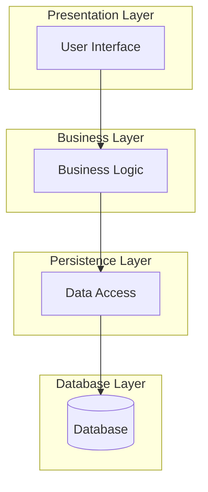

## 1. Definition

### Simple Definition
An **architectural style** is a set of rules and principles that tells you how to organize and structure a software system. It defines the big picture – how major parts (components) connect and communicate.

### One-Line Exam Definition
*"A named set of constraints and patterns that defines the high‑level structure of a software system (e.g., client‑server, layered, microservices)."*

---

## 2. Why Do We Need It?

### The Problem Without Architectural Styles
Every developer builds systems differently → chaos. No common vocabulary, no reusable solutions, and big changes are impossible without breaking everything.

### What an Architectural Style Solves
- **Gives a shared blueprint** – everyone knows the main parts and their roles.
- **Makes systems easier to change** – because the structure is well understood.
- **Promotes reuse** – you can apply the same style to many different problems.
- **Improves communication** – “We use a layered architecture” explains a lot quickly.

### What Happens Without It?
You end up with a **“big ball of mud”** – a messy, tangled system that nobody understands or can safely modify.

---

## 3. Real-World Analogy

**Building a house** – you don’t just pile bricks randomly. You use a **house style** (ranch, colonial, modern). Each style has rules about where the kitchen, bedrooms, and plumbing go. Buyers know what to expect. Similarly, an architectural style tells you where the “rooms” (components) are and how they connect.

---

## 4. When to Use It

- **Starting a new large system** – pick a style before writing code.
- **Team needs a common language** – so everyone talks the same architecture.
- **System must be easy to maintain and evolve** – styles enforce separation of concerns.
- **You have non‑functional requirements** (performance, security, scalability) – different styles suit different needs.
- **You need to explain the system to non‑technical people** – a style diagram speaks a thousand words.

---

## 5. Key Terms

| Term | Meaning |
|------|---------|
| **Component** | A major part of the system (e.g., UI, database, business logic). |
| **Connector** | How components talk to each other (e.g., method call, message, HTTP request). |
| **Data** | Information that flows between components. |
| **Constraint** | A rule the style enforces (e.g., “layers can only talk to the layer directly below”). |
| **Architectural Pattern** | A specific solution that follows a style (e.g., MVC is a pattern under the layered style). |

---

## 6. Common Architectural Styles (Components)

Instead of one generic structure, here are the most important exam styles:

| Style | Main Components | Purpose |
|-------|----------------|---------|
| **Client‑Server** | Client, Server, Network | Separate service provider (server) from service requester (client). |
| **Layered (n‑tier)** | Presentation, Business, Persistence, Database | Each layer has a specific job; layers only talk to neighbours. |
| **Microservices** | Many small services, API Gateway, Service Discovery | Each service does one thing; services communicate via lightweight protocols. |
| **Pipe‑and‑Filter** | Filters (process steps), Pipes (data streams) | Data flows through a chain of transformations. |
| **Event‑Driven** | Event producers, Event bus/channel, Event consumers | Components react to events; decoupled via an event bus. |

*(You only need to describe the style asked in your exam – this table gives you quick definitions.)*

---

## 7. Diagram – Example of Layered Style



**Rule:** Each layer can only talk to the layer directly below it.

---

## 8. How It Works (Generic)

1. **Choose a style** based on your requirements (e.g., choose layered for a simple business app).
2. **Identify major components** – what are the big pieces? (UI, logic, storage, etc.)
3. **Define communication rules** – who can talk to whom? (e.g., only adjacent layers).
4. **Place each piece of code inside the correct component** – enforce the style during development.
5. **Evaluate and evolve** – the style is a guide, not a prison; adjust when needed.

---

## 9. Simple Example – A Layered Web Application

```java
// Presentation Layer (Servlet or Controller)
public class LoginController {
    private UserService service = new UserService();
    
    public void handleLogin(String username, String password) {
        boolean valid = service.authenticate(username, password);
        if (valid) showHomePage();
        else showError();
    }
}

// Business Layer
public class UserService {
    private UserRepository repo = new UserRepository();
    
    public boolean authenticate(String username, String password) {
        User user = repo.findByUsername(username);
        return user != null && user.checkPassword(password);
    }
}

// Persistence Layer
public class UserRepository {
    public User findByUsername(String username) {
        // SQL query to database
        return new User(...);
    }
}
```

**Explanation:** The controller (presentation) calls the service (business), which calls the repository (persistence). No layer skips another – this follows the layered style.

---

## 10. Real Software Examples

| System | Architectural Style |
|--------|---------------------|
| **Gmail (web email)** | Client‑Server (browser client, Google’s servers) |
| **Spring Boot web app** | Layered (Controller → Service → Repository → DB) |
| **Netflix** | Microservices (each service handles recommendations, billing, streaming, etc.) |
| **Unix command line (grep | sort | wc)** | Pipe‑and‑Filter (filters connected by pipes) |
| **E‑commerce order processing** | Event‑Driven (OrderPlaced event triggers inventory, payment, shipping) |

---

## 11. Advantages

- **Clarity** – Everyone understands the high‑level design.
- **Reuse** – Same style can be applied to many projects.
- **Separation of concerns** – Each component has a clear job.
- **Easier maintenance** – You know where to fix a bug (e.g., UI bug → presentation layer).
- **Team productivity** – Different teams can work on different components in parallel.

---

## 12. Disadvantages

- **Can be too rigid** – Enforcing strict rules might slow down simple tasks.
- **Learning curve** – New team members must learn the style.
- **Overkill for small systems** – A small script does not need a layered architecture.
- **Can lead to extra work** – You might write more boilerplate code to fit the style.
- **Not a silver bullet** – A wrong style choice can hurt performance or scalability.

---

## 13. How to Identify in Exams

### Exam Keywords

| Keyword | Why It Points to Architectural Style |
|---------|---------------------------------------|
| “High‑level structure” / “Big picture” | Styles define the overall shape of the system. |
| “Client‑server” / “Layered” / “Microservices” | These are concrete style names. |
| “Components and connectors” | The classic definition of a style. |
| “Separation of concerns” / “Layers” | Indicates a layered architectural style. |
| “Request / response” | Often points to client‑server or web‑based styles. |

---

## 14. Comparison – Architecture vs Design

| Aspect | Architectural Style | Design Pattern |
|--------|---------------------|----------------|
| **Scope** | Whole system | Single component or class |
| **Level** | High‑level (coarse) | Low‑level (fine) |
| **Affects** | Component placement, communication | Object creation, behaviour |
| **Example** | Layered, client‑server, microservices | Singleton, Factory, Observer |
| **Who defines** | Architects | Developers |

---

## 15. Viva Questions (Short Answers)

| # | Question | Answer |
|---|----------|--------|
| 1 | What is an architectural style? | A set of rules that defines the high‑level structure of a software system. |
| 2 | Name three common architectural styles. | Client‑server, layered, microservices, pipe‑and‑filter, event‑driven (any three). |
| 3 | Why do we need an architectural style? | To avoid “big ball of mud” – gives a common blueprint and makes changes easier. |
| 4 | What is the difference between architectural style and design pattern? | Style is system‑wide; pattern solves a smaller, local problem. |
| 5 | Give an example of a system that uses layered architecture. | A typical Spring Boot web application (Controller → Service → Repository). |
| 6 | What is the main communication rule in a layered style? | A layer can only talk to the layer directly below it. |
| 7 | When would you choose microservices over layered? | When you need independent scaling, deployment, and teams for different parts. |
| 8 | Name one disadvantage of a strict layered style. | It can add unnecessary boilerplate for simple features. |
| 9 | What does “component” mean in architectural styles? | A major functional part of the system (e.g., UI, database). |
| 10 | What is a connector? | The way components communicate (e.g., HTTP, method call, message queue). |

---

## 16. Memory Tip

**“Cats Love Playing With Mice”** – for the main styles:
- **C**lient‑Server
- **L**ayered
- **P**ipe‑and‑Filter
- **W** (Microservices – okay, not perfect) → **M**icroservices
- **E**vent‑Driven

Better mnemonic: **C**lients **L**ike **P**ipes **M**ore **E**veryday.

Or simply remember the **house analogy**: different house styles = different architectural styles. Choose one before building.

---

## 17. Quick Revision

### Category
Software Architecture (High‑level design)

### Problem
Without a style, systems become messy (“big ball of mud”) – hard to understand, change, or scale.

### Solution
Adopt a named architectural style (client‑server, layered, microservices, etc.) that defines components, connectors, and constraints.

### Key Components
- **Component** – major part (UI, logic, storage)
- **Connector** – communication method (HTTP, message, call)
- **Data** – information passed between components
- **Constraint** – rule (e.g., “layers talk only to neighbour”)

### Advantages
Clarity, reuse, separation of concerns, easier maintenance, team productivity.

### Disadvantages
Rigidity, learning curve, overkill for small systems, extra boilerplate.

### Keywords
High‑level structure, components & connectors, client‑server, layered, microservices, pipe‑and‑filter, event‑driven, separation of concerns.

### One‑Line Exam Definition
*“A set of principles that defines the high‑level structure of a software system, including its components and how they communicate.”*

### One‑Line Summary
**Architectural style = blueprint for the big picture of your software.**

---

<Callout type="success">
  **Exam Tip:** If a question asks “what architectural style would you choose for X?” think about:  
  – **Layered** → standard business app.  
  – **Client‑Server** → when clients need remote services.  
  – **Microservices** → large, independently deployable teams/parts.  
  – **Event‑Driven** → loose coupling and asynchronous reactions.  
  – **Pipe‑and‑Filter** → data transformation pipelines.
</Callout>