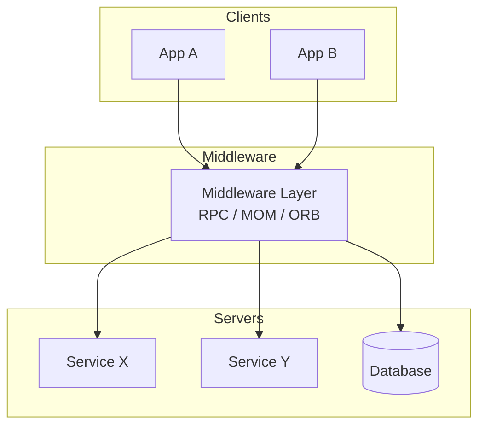

## 1. Definition

### Simple Definition
Middleware is a **software layer** between the operating system/network and applications. It helps different applications, services, or components communicate and share data easily.

### One‑Line Exam Definition
*“A software layer that acts as a bridge between distributed systems, simplifying communication and integration.”*

---

## 2. Why Do We Need It?

### The Problem It Solves
Without middleware, every application would need to know network details, data formats, and protocols of every other application – too complex.

### Why Was It Created?
To hide the complexity of distributed communication – developers write code as if talking locally, while middleware handles network, conversion, and reliability.

### What Happens Without It?
Each application implements its own communication – massive duplication, tight coupling, hard to maintain.

---

## 3. Real‑World Analogy

**Translator at a UN meeting** – delegates speak different languages. Translator (middleware) converts each speech so everyone understands. Delegates don’t need to learn other languages.

---

## 4. When to Use It

- **Distributed systems** with multiple components on different machines.
- **Heterogeneous environments** (different OS, languages, databases).
- **Enterprise application integration** (connecting legacy systems).
- **Message‑based communication** (publish‑subscribe, request‑reply).

---

## 5. Key Terms

| Term | Meaning |
|------|---------|
| **Middleware** | Software layer between OS and applications. |
| **MOM** | Message‑Oriented Middleware – uses messages. |
| **RPC** | Remote Procedure Call – call function on another machine. |
| **ORB** | Object Request Broker – remote object method calls. |
| **Message broker** | Middleware that routes messages (e.g., RabbitMQ, Kafka). |

---

## 6. Structure / Components

| Component | Purpose |
|-----------|---------|
| **Middleware layer** | Central software that handles communication. |
| **Client applications** | Initiate requests via middleware. |
| **Servers / services** | Provide responses via middleware. |
| **Databases / networks** | Accessed through middleware. |

**Role:** Middleware translates protocols, formats data, routes messages, handles security.

---

## 7. Diagram

### Middleware as Bridge



---

## 8. How It Works (General)

1. **Client application** calls a middleware API (e.g., send message, call remote function).
2. **Middleware** locates the target service, translates data format if needed.
3. **Middleware** sends request over network (handles retries, security).
4. **Target service** receives request, processes, returns response.
5. **Middleware** delivers response back to client.

**Client sees a local call; middleware does the remote work.**

---

## 9. Types of Middleware (from slides)

| Type | Purpose | Example |
|------|---------|---------|
| **Message‑Oriented (MOM)** | Asynchronous message passing | RabbitMQ, Apache Kafka |
| **RPC Middleware** | Call functions remotely | Java RMI, XML‑RPC |
| **Database Middleware** | Connect apps to databases | ODBC, JDBC |
| **Object Request Broker (ORB)** | Remote object method calls | CORBA |
| **Web Middleware** | Web servers, app servers, APIs | Apache Tomcat, REST APIs |

---

## 10. Simple Example (Java RMI – RPC middleware)

```java
// Remote interface
public interface Calculator extends Remote {
    int add(int a, int b) throws RemoteException;
}

// Server – implements and registers
public class CalculatorImpl extends UnicastRemoteObject implements Calculator {
    public int add(int a, int b) { return a + b; }
}

// Client – looks up and calls
Calculator calc = (Calculator) Naming.lookup("rmi://server/calc");
int result = calc.add(5, 3);  // feels like local call
```

**Explanation:** RMI middleware handles network, object serialisation, lookup.

---

## 11. Real Software Examples (from slides)

| Middleware | Type | Use Case |
|------------|------|----------|
| **Apache Kafka** | MOM | Streaming data, event processing. |
| **RabbitMQ** | MOM | Message queuing. |
| **CORBA** | ORB | Legacy enterprise integration. |
| **Java RMI** | RPC | Java‑to‑Java remote calls. |
| **REST APIs + HTTP** | Web middleware | Web services. |

**Online banking example (from slides):** Mobile app, web app, database all communicate through middleware handling authentication, transactions, messaging.

---

## 12. Advantages (from slides)

| Advantage | Why It’s Good |
|-----------|---------------|
| **Simplifies distributed communication** | Hides network complexity. |
| **Supports heterogeneous platforms** | Different OS/languages can talk. |
| **High scalability** | Add more clients/servers easily. |
| **Easy integration** | Plug new systems into middleware. |

---

## 13. Disadvantages (from slides)

| Disadvantage | Why It’s Bad |
|--------------|---------------|
| **Increased system overhead** | Extra processing for marshalling, routing. |
| **Complex deployment and maintenance** | Middleware itself needs management. |
| **Middleware failure affects many systems** | Single point of failure risk. |

---

## 14. How to Identify in Exams

### Exam Keywords

| Keyword | Points to Middleware |
|---------|----------------------|
| “Software layer between OS and apps” | Definition. |
| “Message broker” / “MOM” | Type. |
| “RPC” / “RMI” / “CORBA” | Examples. |
| “Bridge between distributed systems” | Role. |
| “Heterogeneous communication” | Benefit. |

---

## 15. Viva Questions

| # | Question | Answer |
|---|----------|--------|
| 1 | What is middleware? | A software layer facilitating communication between distributed applications. |
| 2 | Name three types of middleware. | MOM, RPC, database middleware, ORB, web middleware. |
| 3 | Give an example of MOM. | RabbitMQ, Apache Kafka. |
| 4 | What does RPC stand for? | Remote Procedure Call. |
| 5 | What is a disadvantage of middleware? | Performance overhead, single point of failure. |
| 6 | How does middleware help heterogeneous systems? | Translates data formats and protocols. |
| 7 | What is the role of an ORB? | Enables remote object method calls (e.g., CORBA). |

---

## 16. Memory Tip

**“Middle = between OS and apps”** – remember the layer.

**MOM = Messages On the Move.**

---

## 17. Quick Revision

### Category
Distributed Architecture

### Problem
Direct network communication is complex and low‑level.

### Solution
Middleware layer handles communication, translation, routing.

### Key Components
- Middleware layer
- Client apps
- Servers/services

### Types
MOM, RPC, database, ORB, web middleware.

### Advantages
Simplifies distributed apps, heterogeneous support, scalability.

### Keywords
Middleware, MOM, RPC, ORB, message broker, heterogeneity.

### One‑Line Exam Definition
*“A software layer between operating system and applications that simplifies distributed communication.”*

### One‑Line Summary
**Middleware = universal translator for distributed systems.**

---

<Callout type="success">
  **Exam Tip:** When asked for examples – mention RabbitMQ (MOM), Java RMI (RPC), CORBA (ORB), and JDBC (database middleware).
</Callout>
