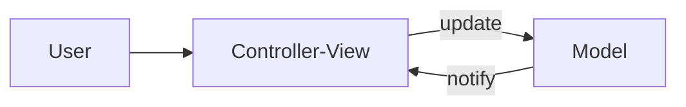
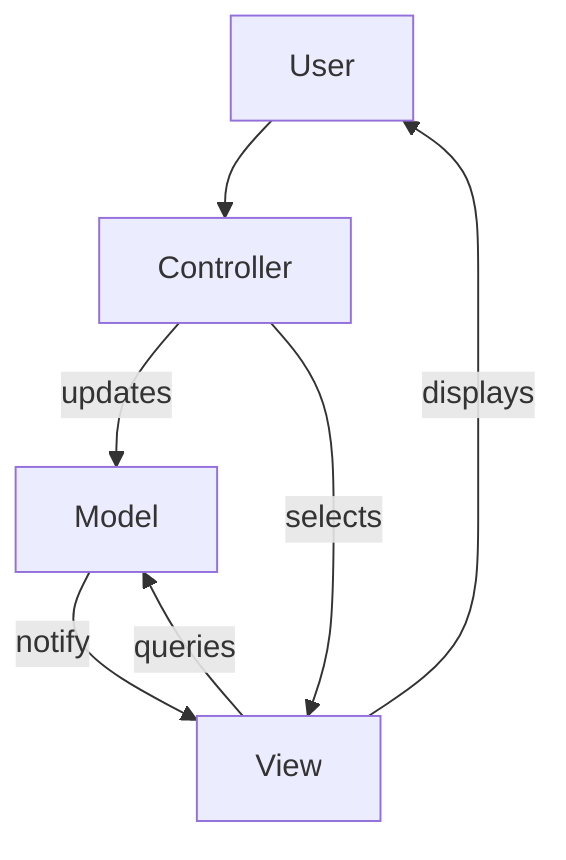
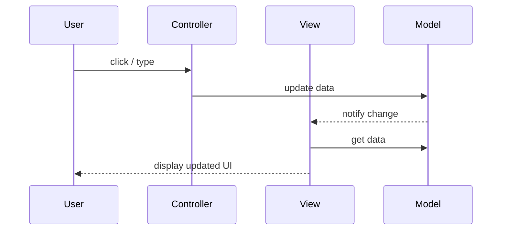

## 1. Definition

### Simple Definition
MVC splits an application into three parts: **Model** (data), **View** (user interface), and **Controller** (handles input and updates). This separation makes it easy to change one part without affecting others.

### One‑Line Exam Definition
*“Architecture that separates data (Model), display (View), and input handling (Controller) for interactive applications.”*

---

## 2. Why Do We Need It?

### The Problem It Solves
Without MVC, UI code is mixed with business logic and data access – hard to test, reuse, or change the interface.

### Why Was It Created?
To support multiple views of the same data (e.g., bar chart + table), and to make GUI development more modular.

### What Happens Without It?
Changing the UI breaks logic; duplicating code for each new view; impossible to maintain.

---

## 3. Real‑World Analogy

**Restaurant:**
- **Model** = kitchen (data and recipes)
- **View** = menu (display)
- **Controller** = waiter (takes order, updates kitchen, brings food)

Customer (user) interacts only with waiter (controller). Waiter updates kitchen (model), and kitchen changes the food (data). Menu (view) shows available dishes.

---

## 4. When to Use It

- Web applications (Spring MVC, ASP.NET MVC).
- Desktop GUI applications (Java Swing, Qt).
- Mobile apps (iOS, Android – variants of MVC).
- Any application where multiple views of same data are needed.

---

## 5. Key Terms

| Term | Meaning |
|------|---------|
| **Model** | Manages data, business logic, rules. Notifies observers when data changes. |
| **View** | Displays data to user. Requests data from Model. |
| **Controller** | Receives user input, updates Model, selects View. |
| **Subscribe‑Notify** | Observer pattern – Views register with Model to get updates. |

---

## 6. Structure / Components (MVC‑I)

From slides – MVC‑I (simple version) has Controller+View combined.



### MVC‑II (separated)



**Components:**

| Component | Purpose |
|-----------|---------|
| **Model** | Stores data, implements business logic. Active – notifies registered Views. |
| **View** | Displays data. Subscribes to Model. Can query Model directly. |
| **Controller** | Accepts user input, converts to Model updates, chooses next View. |

---

## 7. Diagram – MVC Collaboration (from slides)



---

## 8. How It Works (MVC‑II)

1. **User interacts** with Controller (e.g., clicks button).
2. **Controller modifies** Model (e.g., changes data).
3. **Model notifies** all registered Views that data changed.
4. **Each View** queries Model for fresh data.
5. **View updates** its display.
6. **Controller may also** select a different View (e.g., navigate to another screen).

**Note:** Model never knows about Views directly – uses observer pattern.

---

## 9. Simple Example (Java Spring MVC – conceptual)

```java
// Model
@Entity
public class User {
    private String name;
    // getters/setters
}

// Controller
@Controller
public class UserController {
    @Autowired private UserRepository repo;
    
    @GetMapping("/user/{id}")
    public String getUser(@PathVariable Long id, Model model) {
        User user = repo.findById(id);
        model.addAttribute("user", user);
        return "userView"; // view name
    }
}

// View (userView.html)
<h1 th:text="${user.name}"></h1>
```

**Explanation:** Controller fetches Model data, puts in Model object, selects View. View renders using data.

---

## 10. Real Software Examples

| System | MVC Usage |
|--------|-----------|
| **Spring MVC** | Web framework – Controller, Model, View (JSP/Thymeleaf). |
| **ASP.NET Core MVC** | Microsoft’s MVC for web apps. |
| **Ruby on Rails** | MVC by convention. |
| **Java Swing** | Desktop – uses MVC pattern (e.g., JTable model/view). |
| **iOS UIKit** | ViewController is Controller, Model separate, View is storyboard/xib. |

---

## 11. Advantages (from slides)

| Advantage | Why It’s Good |
|-----------|---------------|
| **Multiple views** | Same Model can have many Views (chart, table, mobile). |
| **Plug‑gable interfaces** | Easy to change or add new Views. |
| **Clear separation** | Graphics, logic, database teams can work independently. |
| **Vendor frameworks** | Many MVC toolkits available (Spring, ASP.NET). |

---

## 12. Disadvantages (from slides)

| Disadvantage | Why It’s Bad |
|--------------|---------------|
| **Not suitable for agent‑oriented apps** | Mobile agents, robotics – PAC better. |
| **Multiple controllers/views expensive** | Changes to Model can impact many pairs. |
| **Division between View and Controller unclear** | Sometimes View and Controller overlap (e.g., in some GUI frameworks). |

---

## 13. How to Identify in Exams

### Exam Keywords

| Keyword | Points to MVC |
|---------|---------------|
| “Model, View, Controller” | Direct. |
| “Separate data from display” | Core idea. |
| “Subscribe‑notify” | Model → View communication. |
| “Interactive application” | Typical domain. |
| “Spring MVC” / “Rails” | Examples. |

---

## 14. Comparison – MVC‑I vs MVC‑II

| Aspect | MVC‑I | MVC‑II |
|--------|-------|--------|
| **View and Controller** | Combined into one module | Separated |
| **Complexity** | Simpler | More modular |
| **Flexibility** | Lower | Higher |
| **Example** | Small GUI apps | Web frameworks (Spring) |

---

## 15. Viva Questions

| # | Question | Answer |
|---|----------|--------|
| 1 | What does MVC stand for? | Model‑View‑Controller. |
| 2 | What is the Model responsible for? | Data and business logic. |
| 3 | What is the View responsible for? | Displaying data to user. |
| 4 | What is the Controller responsible for? | Handling user input and updating Model. |
| 5 | How does View know Model changed? | Model notifies registered Views (observer). |
| 6 | Give an example of MVC framework. | Spring MVC, ASP.NET MVC, Ruby on Rails. |
| 7 | What is a benefit of MVC? | Multiple views of same data. |
| 8 | What is a disadvantage? | Not ideal for agent‑based systems. |

---

## 16. Memory Tip

**“Model is mind, View is face, Controller is hands”** – mind (data), face (display), hands (actions).

---

## 17. Quick Revision

### Category
Interaction‑Oriented Architecture

### Problem
UI and logic tangled; multiple views difficult.

### Solution
Separate Model (data), View (display), Controller (input).

### Key Components
- Model – data + logic
- View – UI
- Controller – input handler

### Advantages
Multiple views, pluggable interfaces, team separation.

### Keywords
Model, View, Controller, subscribe‑notify, MVC‑I, MVC‑II.

### One‑Line Exam Definition
*“Separates application into data (Model), display (View), and input handling (Controller).”*

### One‑Line Summary
**MVC = split screen (View), brain (Model), and hands (Controller).**

---

<Callout type="success">
  **Exam Tip:** Remember that Model is active – it notifies Views. This is the observer pattern.
</Callout>
