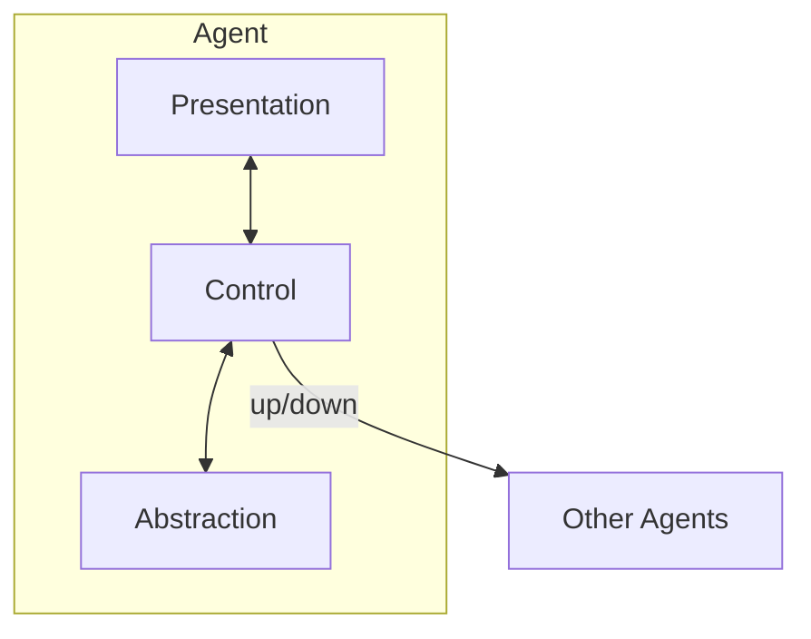
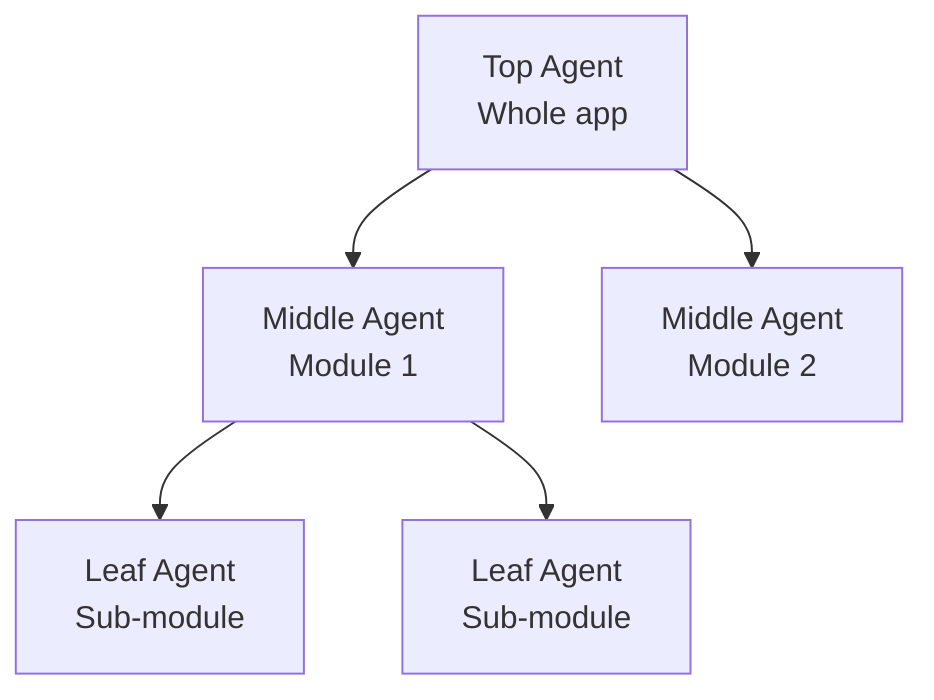

## 1. Definition

### Simple Definition
PAC is an interaction‑oriented architecture that organises the system as a **hierarchy of agents**. Each agent has its own Presentation (UI), Abstraction (data), and Control (logic). Agents communicate upward/downward.

### One‑Line Exam Definition
*“A hierarchical agent‑based architecture where each agent has its own Presentation, Abstraction, and Control components.”*

---

## 2. Why Do We Need It?

### The Problem It Solves
MVC works well for a single interactive application but struggles with **distributed, agent‑oriented systems** (e.g., robotics, multi‑window applications with independent parts).

### Why Was It Created?
To support applications where multiple semi‑autonomous components need to interact while maintaining their own data and UI.

### What Happens Without It?
Building complex interactive distributed systems becomes messy – no clear separation of responsibilities per component.

---

## 3. Real‑World Analogy

**Office building with floors** – each floor (agent) has its own:
- **Presentation** = layout of cubicles.
- **Abstraction** = employees and their data.
- **Control** = floor manager.

Floors communicate only with the floor above/below (hierarchy). No floor talks directly to non‑adjacent floors.

---

## 4. When to Use It

- **Agent‑oriented applications** (robotics, intelligent agents).
- **Distributed interactive systems** (multi‑window apps, collaborative tools).
- **Systems requiring hierarchical control** (e.g., GUI with embedded sub‑dialogs).
- **Applications where MVC’s flat structure is insufficient.**

---

## 5. Key Terms

| Term | Meaning |
|------|---------|
| **Agent** | Self‑contained unit with Presentation, Abstraction, Control. |
| **Presentation** | Handles user interface for that agent. |
| **Abstraction** | Manages data and core functionality of the agent. |
| **Control** | Coordinates the agent’s internal parts and communicates with other agents. |
| **Hierarchy** | Agents are arranged in levels – top agent coordinates lower ones. |

---

## 6. Structure / Components

**Each agent has three parts:**

| Component | Purpose |
|-----------|---------|
| **Presentation** | User interface of that agent (what user sees). |
| **Abstraction** | Data model and domain logic for that agent. |
| **Control** | Mediates between Presentation and Abstraction; communicates with parent/child agents. |

**Hierarchy:** Top agent has no parent; leaf agents have no children.

---

## 7. Diagram

### PAC Agent Structure



### Hierarchical PAC (Example – three agents)



---

## 8. How It Works

1. **Each agent** is autonomous – it has its own data (Abstraction) and UI (Presentation).
2. **Control** inside agent handles local user input and updates Abstraction.
3. **Control also communicates** with parent agent (upwards) and child agents (downwards) when needed.
4. **User interacts** with a leaf agent’s Presentation – that agent handles it locally if possible.
5. **If it affects broader data**, the agent sends a message up the hierarchy.
6. **Parent agent** may coordinate multiple children and update them.

**Key:** No global shared data – each agent has its own Abstraction.

---

## 9. Simple Example (Conceptual)

```java
// Agent: Currency Converter (leaf)
public class CurrencyAgent {
    private Abstraction model;   // exchange rates, amounts
    private Presentation view;   // input fields, buttons
    private Control control;
    
    public CurrencyAgent() {
        model = new Abstraction();
        view = new Presentation(this);
        control = new Control(model, view);
    }
    
    public void onUserInput(double amount) {
        control.convert(amount);
        view.updateDisplay(model.getConvertedAmount());
        // Notify parent if needed
    }
}

// Top Agent: Main Window
public class MainAgent {
    private List<CurrencyAgent> children; // multiple converters
    // coordinates children, e.g., syncing rates
}
```

**Explanation:** Each converter agent is independent; top agent manages them.

---

## 10. Real Software Examples

| System | PAC Usage |
|--------|-----------|
| **Multi‑window IDE (Eclipse)** | Each editor/view is an agent; main window is top agent. |
| **Robotics control system** | Each robot component (arm, camera) as agent. |
| **Collaborative drawing tool** | Each user’s view as agent, server as top agent. |
| **Smart home dashboard** | Each device (light, thermostat) as leaf agent. |

---

## 11. Advantages (over MVC)

| Advantage | Why It’s Good |
|-----------|---------------|
| **Supports distribution** | Agents can run on different machines. |
| **Hierarchical control** | Clear responsibility levels. |
| **Local autonomy** | Each agent handles its own UI and data. |
| **Scalability** | Add new agents without breaking others. |

---

## 12. Disadvantages

| Disadvantage | Why It’s Bad |
|--------------|---------------|
| **Complexity** | More components than MVC. |
| **Communication overhead** | Messages up/down hierarchy. |
| **Harder to debug** | Multiple agents, asynchronous. |
| **Not as widely used** | Less tooling than MVC. |

---

## 13. Comparison – MVC vs PAC (from slides)

| Aspect | MVC | PAC |
|--------|-----|-----|
| **Structure** | Flat, three modules | Hierarchical agents |
| **Number of components** | 3 per application | 3 × (number of agents) |
| **Data sharing** | Single Model shared | Each agent has its own Abstraction |
| **Control** | Centralised in Controller | Distributed among agent Controls |
| **Communication** | Model‑View‑Controller direct | Up/down hierarchy |
| **Best for** | Single interactive app | Distributed, agent‑oriented systems |
| **Example** | Web app | Robotics, multi‑view editors |

---

## 14. How to Identify in Exams

### Exam Keywords

| Keyword | Points to PAC |
|---------|---------------|
| “Hierarchical agents” | Core structure. |
| “Presentation, Abstraction, Control” | Three parts of each agent. |
| “Agent‑oriented” | Contrast with MVC. |
| “Distributed interactive system” | PAC domain. |
| “Overcomes MVC limitations” | From slides. |

---

## 15. Viva Questions

| # | Question | Answer |
|---|----------|--------|
| 1 | What does PAC stand for? | Presentation‑Abstraction‑Control. |
| 2 | How is PAC different from MVC? | PAC is hierarchical agents; MVC is flat three modules. |
| 3 | What is an agent in PAC? | A unit with its own Presentation, Abstraction, Control. |
| 4 | When should you use PAC over MVC? | For distributed, agent‑oriented apps (robotics, multi‑window). |
| 5 | Does PAC have a single shared Model? | No – each agent has its own Abstraction. |
| 6 | How do agents communicate? | Up/down the hierarchy via Control. |
| 7 | Give an example of PAC. | Multi‑window IDE (Eclipse). |

---

## 16. Memory Tip

**“PAC = Agents stacked like pancakes”** – each agent is a layer with its own P, A, C.

**MVC = three musketeers; PAC = army of agents.**

---

## 17. Quick Revision

### Category
Interaction‑Oriented Architecture

### Problem
MVC not suitable for distributed/agent systems.

### Solution
Hierarchy of agents – each agent has Presentation, Abstraction, Control.

### Key Components
- Presentation (UI)
- Abstraction (data)
- Control (coordination, communication)

### Advantages
Distribution, autonomy, scalability.

### Keywords
PAC, agent, hierarchy, Presentation‑Abstraction‑Control.

### One‑Line Exam Definition
*“A hierarchical agent‑based architecture where each agent has its own Presentation, Abstraction, and Control.”*

### One‑Line Summary
**PAC = independent agents in a hierarchy, each with its own UI, data, and logic.**

---

<Callout type="success">
  **Exam Tip:** Compare PAC to MVC – PAC is hierarchical and agent‑based; MVC is flat and centralised.
</Callout>