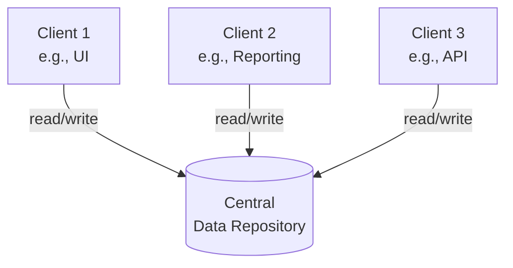
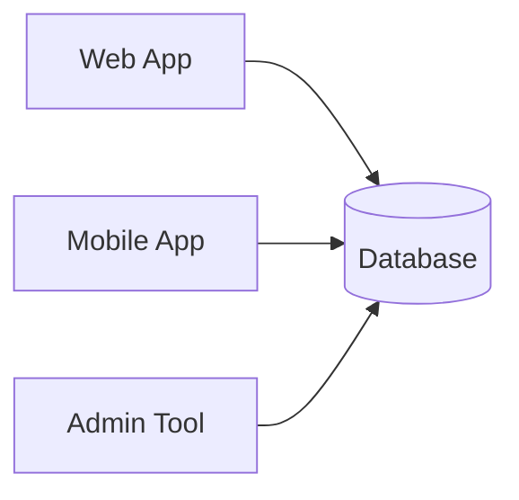

## 1. Definition

### Simple Definition
Repository architecture is a style where a **central data store** (the repository) is shared by multiple independent components. All components read from and write to this same central data store.

### One‑Line Exam Definition
*“An architecture with a shared central data store accessed by multiple independent components (clients/agents).”*

---

## 2. Why Do We Need It?

### The Problem It Solves
Many systems need to share the same data across different functions. Without a central repository, each component would have its own copy of data → inconsistency, wasted storage, and complex synchronisation.

### Why Was It Created?
To provide a **single source of truth** – one place where data lives, and everyone reads/writes to that same place.

### What Happens Without It?
Data gets duplicated, different components have different versions of the same information, and keeping everything consistent becomes a nightmare.

---

## 3. Real‑World Analogy

**School library** – All students (components) go to the same central library (repository) to borrow or return books. There is only one copy of each book. No student keeps a personal copy. The library manages everything.

---

## 4. When to Use Repository Style

- **Information systems** – banking, hospital records, student management.
- **Database‑centric applications** – most business apps with a shared database.
- **CASE tools** – multiple tools (diagram editor, code generator) sharing the same design data.
- **Content management systems** – many users editing the same content.
- **Any system where multiple components need access to the same persistent data.**

---

## 5. Key Terms

| Term | Meaning |
|------|---------|
| **Repository** | Central data store (can be database, file system, or in‑memory). |
| **Clients / Agents** | Independent components that access the repository. |
| **Passive repository** | Repository only stores data; clients control interactions (typical database). |
| **Active repository (Blackboard)** | Repository triggers actions when data changes (see next topic). |
| **Data integrity** | Correctness and consistency of data – easier with central repository. |

---

## 6. Structure / Components

| Component | Purpose |
|-----------|---------|
| **Central Repository** | Stores all shared data. Can be passive (just storage) or active (notifies clients). |
| **Clients (Agents)** | Independent components that read/write to the repository. They may have their own logic but share no direct connections with each other. |
| **Communication** | Usually method calls or queries (SQL, REST, etc.). Clients talk only to the repository, not to each other. |

---

## 7. Diagram

### Simple Repository Architecture



Clients are independent – they only know the repository.

### With Database Example



---

## 8. How It Works

1. **Repository is created** – central data store is set up (e.g., a database).
2. **Clients connect** – each client (UI, service, report generator) connects to the repository.
3. **Read/write operations** – clients query or update data using the repository’s interface (e.g., SQL, REST API).
4. **No direct client‑to‑client communication** – if client A updates data, client B sees the change only by reading from the repository again.
5. **Concurrency control** – repository (or database) handles multiple clients accessing the same data (locks, transactions).

**Result:** Data is centralised, consistent, and easy to back up.

---

## 9. Simple Example

### Java – Repository with a simple in‑memory store

```java
// Repository – central data store
public class StudentRepository {
    private Map<Integer, Student> store = new HashMap<>();
    
    public void save(Student s) {
        store.put(s.getId(), s);
    }
    
    public Student findById(int id) {
        return store.get(id);
    }
    
    public List<Student> findAll() {
        return new ArrayList<>(store.values());
    }
}

// Client 1 – Registration component
public class RegistrationService {
    private StudentRepository repo;
    
    public RegistrationService(StudentRepository repo) {
        this.repo = repo;
    }
    
    public void register(Student s) {
        repo.save(s);
        System.out.println("Registered: " + s.getName());
    }
}

// Client 2 – Reporting component
public class ReportGenerator {
    private StudentRepository repo;
    
    public ReportGenerator(StudentRepository repo) {
        this.repo = repo;
    }
    
    public void printAll() {
        for (Student s : repo.findAll()) {
            System.out.println(s);
        }
    }
}

// Main
public class Main {
    public static void main(String[] args) {
        StudentRepository repo = new StudentRepository(); // central repository
        
        RegistrationService reg = new RegistrationService(repo);
        ReportGenerator report = new ReportGenerator(repo);
        
        reg.register(new Student(1, "Alice"));
        reg.register(new Student(2, "Bob"));
        report.printAll(); // sees all students
    }
}
```

**Key point:** Both clients share the same `repo` instance – they are independent but data is centralised.

---

## 10. Real Software Examples

| System | How It Uses Repository |
|--------|------------------------|
| **Relational database (MySQL, PostgreSQL)** | Multiple applications share the same database. |
| **Git repository** | Central source code store (or distributed, but the concept is similar). |
| **CASE tools (Rational Rose, Enterprise Architect)** | Multiple tools share the same UML model repository. |
| **Hospital information system** | Different departments (admission, pharmacy, billing) share patient data. |
| **ERP system (SAP, Oracle)** | All modules (finance, HR, inventory) share a central database. |

---

## 11. Advantages

| Advantage | Why It’s Good |
|-----------|---------------|
| **Data integrity** | One place to back up, restore, and enforce consistency. |
| **Centralised control** | Easy to manage access rights, security, and transactions. |
| **Data sharing** | All components see the same up‑to‑date information. |
| **Reduces data duplication** | No need for each client to store its own copy. |
| **Scalability** | Can scale the repository (e.g., database clustering) independently of clients. |

---

## 12. Disadvantages

| Disadvantage | Why It’s Bad |
|--------------|---------------|
| **Single point of failure** | If the repository fails, the whole system fails. |
| **Performance bottleneck** | All clients hit the same data store – can become slow. |
| **High dependency** | Changes to data structure (e.g., database schema) affect all clients. |
| **Network overhead** | If repository is remote, each access costs network time. |
| **Concurrency complexity** | Must handle multiple writers carefully (locks, transactions). |

---

## 13. How to Identify in Exams

### Exam Keywords

| Keyword | Why It Points to Repository |
|---------|----------------------------|
| “Central data store” | Direct definition. |
| “Shared database” | Most common real‑world form. |
| “Multiple components access the same data” | Core idea. |
| “Information system” / “Business application” | Typical domain. |
| “Passive repository” | Contrast with blackboard. |
| “Data integrity” / “Single source of truth” | Key benefits. |

---

## 14. Comparison – Repository vs Blackboard

| Aspect | Repository (Passive) | Blackboard (Active) |
|--------|----------------------|----------------------|
| **Data store role** | Passive – just stores data | Active – triggers events |
| **Client role** | Clients initiate all actions | Clients react to changes |
| **Control** | Clients decide when to read/write | Data changes control flow |
| **Communication** | Clients call repository | Repository calls clients |
| **Typical use** | Business databases | AI, pattern recognition, monitoring |
| **Example** | Banking system | Voice recognition system |

*(Blackboard is next topic – this comparison helps both.)*

---

## 15. Viva Questions

| # | Question | Answer |
|---|----------|--------|
| 1 | What is a repository architecture? | A central data store shared by multiple independent components. |
| 2 | Give a real example. | A hospital database accessed by admission, billing, and pharmacy systems. |
| 3 | What is a passive repository? | Repository only stores data; clients control interactions. |
| 4 | What is a major advantage? | Data integrity – one source of truth. |
| 5 | What is a major disadvantage? | Single point of failure – if repository crashes, everything stops. |
| 6 | How do clients communicate in repository style? | They don’t talk directly – only through the repository. |
| 7 | What is the difference between repository and blackboard? | Repository is passive; blackboard is active (triggers events). |
| 8 | Name a software that uses repository style. | Any database‑driven application – e.g., a library management system. |
| 9 | What is “data integrity”? | The correctness and consistency of data. |
| 10 | How does repository style help with backups? | Only one data store to back up, not many client copies. |

---

## 16. Memory Tip

**“Repo = One Stop Shop”** – everyone goes to the same place for data.

Analogy: **A whiteboard in a team room** – everyone reads from and writes to the same board. No one keeps their own private version.

---

## 17. Quick Revision

### Category
Data‑Centered Architectural Style

### Problem
Multiple components need to share data. Without a central store, data becomes inconsistent and duplicated.

### Solution
Create a central repository (database, file store). All components read/write to it. No direct component‑to‑component communication.

### Key Components
- Central repository (data store)
- Independent clients/agents

### Advantages
Data integrity, centralised control, sharing, reduces duplication, scalability.

### Disadvantages
Single point of failure, bottleneck, dependency on schema, network overhead, concurrency complexity.

### Keywords
Repository, central data store, passive, client, agent, database, single source of truth.

### One‑Line Exam Definition
*“Architecture with a shared central data store accessed by independent components.”*

### One‑Line Summary
**Repository = one central data store for everyone.**

---

<Callout type="info">
  **Exam Tip:** When asked “when would you choose repository style?” – answer: when multiple independent subsystems need to share persistent data and consistency is critical. Mention database‑centric business applications as prime examples.
</Callout>


