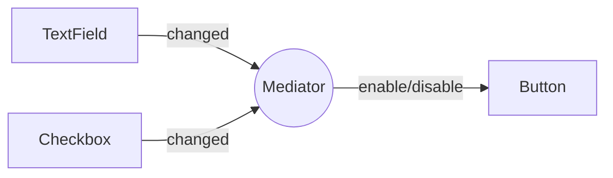

## 1. Definition (One Line)

**A mediator is a middleman object that handles all communication between other objects. Objects never talk directly to each other – only to the mediator.**

---

## 2. Why Do We Need It?

Without a mediator, objects talk to everyone → a messy spiderweb of connections. If one object changes, many break.

**Mediator fixes this:** each object only knows the mediator. The mediator knows everyone.

---

## 3. Real-World Analogy

**Chat room:** You don't message everyone directly. You send a message to the chat server (mediator), and the server sends it to others.

**Airport control tower:** Planes don't talk to each other. They talk to the tower.

---

## 4. Simple Structure

| Part | What it does |
|------|---------------|
| **Mediator** | The boss – knows all components, decides what happens when |
| **Colleague** | Any component (button, text field) – only knows the mediator |

---

## 5. How It Works (Step by Step)

1. User types in a text field.
2. Text field tells mediator: "Hey, I changed!"
3. Mediator checks all components (text field, checkbox, button).
4. Mediator decides: "Now the button should be enabled."
5. Mediator tells button: "Enable yourself."

**Result:** Text field never knew the button existed.

---

## 6. Simple Code Example

### Step 1: Mediator interface

```java
interface Mediator {
    void notify(Component sender, String event);
}
```

### Step 2: Base Component

```java
abstract class Component {
    protected Mediator mediator;
    
    Component(Mediator mediator) {
        this.mediator = mediator;
    }
    
    void tellMediator(String event) {
        mediator.notify(this, event);
    }
}
```

### Step 3: Concrete Components

```java
class TextField extends Component {
    private String text = "";
    
    TextField(Mediator mediator) { super(mediator); }
    
    void setText(String text) {
        this.text = text;
        System.out.println("Text set to: " + text);
        tellMediator("textChanged");
    }
    
    String getText() { return text; }
}

class Button extends Component {
    private boolean enabled = false;
    
    Button(Mediator mediator) { super(mediator); }
    
    void setEnabled(boolean enabled) {
        this.enabled = enabled;
        System.out.println("Button enabled: " + enabled);
    }
    
    void click() {
        if (enabled) System.out.println("Button clicked!");
    }
}
```

### Step 4: Concrete Mediator (the boss)

```java
class LoginMediator implements Mediator {
    private TextField username;
    private Button submit;
    
    void setUsername(TextField tf) { this.username = tf; }
    void setSubmit(Button btn) { this.submit = btn; }
    
    @Override
    public void notify(Component sender, String event) {
        // Any change → check if username not empty
        boolean shouldEnable = !username.getText().isEmpty();
        submit.setEnabled(shouldEnable);
    }
}
```

### Step 5: Usage

```java
public class Main {
    public static void main(String[] args) {
        LoginMediator mediator = new LoginMediator();
        
        TextField username = new TextField(mediator);
        Button submit = new Button(mediator);
        
        mediator.setUsername(username);
        mediator.setSubmit(submit);
        
        username.setText("john");  // triggers mediator → enables button
        submit.click();            // works now
    }
}
```

**Output:**
```
Text set to: john
Button enabled: true
Button clicked!
```

---

## 7. When to Use (Exam Keywords)

| Problem description | Use Mediator |
|---------------------|--------------|
| "Many objects need to communicate" | ✅ |
| "Don't want objects to know each other" | ✅ |
| "Chat room / control tower / dialog box" | ✅ |
| "Central coordinator needed" | ✅ |

---

## 8. Advantages & Disadvantages (Short)

| Advantages | Disadvantages |
|------------|---------------|
| Loose coupling – objects stay independent | Mediator can become a "god object" (too much logic) |
| Easy to change rules – only modify mediator | Single point of failure |
| Components are reusable | Overkill for 2-3 objects |

---

## 9. Quick Comparison (vs Observer)

| Mediator | Observer |
|----------|----------|
| Many-to-many communication | One-to-many broadcast |
| Mediator decides who gets what | Subject notifies all observers |
| Centralized logic | Decentralized |

---

## 10. One Page Revision

### Problem
Too many direct connections → messy code.

### Solution
A central mediator handles all communication.

### Key Parts
- **Mediator** – the boss
- **Colleague** – worker that only talks to boss

### Simple Definition
*"Objects only talk to the mediator, not to each other."*

### Memory Trick
> **Mediator = Receptionist.** Everyone calls receptionist; receptionist coordinates.

---



<Callout type="success">
  **Remember:** Don't let objects talk directly. Put a middleman in charge.
</Callout>

