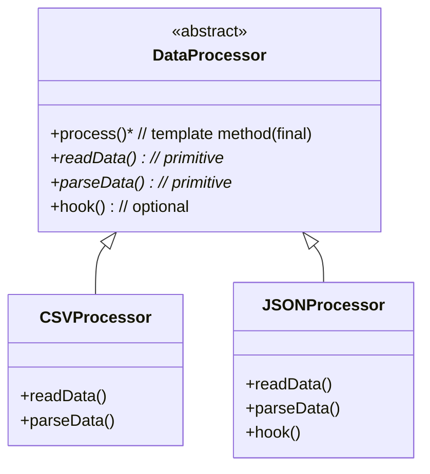
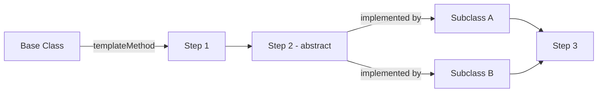

## 1. Definition

### Simple Definition
The Template Method pattern lets you define the **steps** of an algorithm in a base class, but allows subclasses to change **specific steps** without changing the overall structure.

### One-Line Exam Definition
*"Base class defines algorithm skeleton; subclasses fill in the blanks."*

---

## 2. Why Do We Need It?

### The Problem
You have several classes that do similar things, but with small differences. Without this pattern, you copy‑paste the same code everywhere. If you need to change the common steps, you must update every class.

### What This Solves
- **No code duplication** – common steps live in one place.
- **Easy to add new variants** – just create a new subclass and override only what’s different.
- **Consistent algorithm order** – nobody can accidentally change the sequence of steps.

---

## 3. Real-World Analogy

### Making Coffee vs Tea
The recipe is the same for both:
1. Boil water
2. Brew (coffee grounds **or** tea leaves)
3. Pour in cup
4. Add condiments (sugar, milk, **or** lemon)

The **algorithm skeleton** never changes. Only the `brew()` and `addCondiments()` steps are different.

---

## 4. Core Idea (Simple)

**Put the common steps in a base class method (the “template method”). Make the varying steps abstract. Subclasses implement only the varying parts.**

The base class controls **when** each step runs. Subclasses control **what** each step does.

---

## 5. Simple Terminology

| Term | Meaning |
|------|---------|
| **Template Method** | The public method in the base class that calls the steps in order. Usually marked `final` so no one can reorder it. |
| **Primitive Operation** | An abstract method that subclasses **must** implement. |
| **Hook Method** | An optional method with an empty default. Subclasses can override it if they want. |

---

## 6. Structure Diagram



---

## 7. How It Works (Flow)

```mermaid
flowchart TD
    Start[Client calls templateMethod] --> A[Base: openFile]
    A --> B[Base: call readData]
    B --> C[Subclass implements readData]
    C --> D[Base: call parseData]
    D --> E[Subclass implements parseData]
    E --> F[Base: call hook (if overridden)]
    F --> G[Base: closeFile]
    G --> End[Done]
```

---

## 8. Simple Code Example

### Step 1: Abstract Base Class

```java
public abstract class BeverageMaker {
    
    // Template method – the recipe (final so no one changes order)
    public final void makeBeverage() {
        boilWater();
        brew();           // different for coffee/tea
        pourInCup();
        addCondiments();  // different for coffee/tea
    }
    
    private void boilWater() {
        System.out.println("Boiling water");
    }
    
    private void pourInCup() {
        System.out.println("Pouring into cup");
    }
    
    // Steps that subclasses must implement
    protected abstract void brew();
    protected abstract void addCondiments();
}
```

### Step 2: Concrete Subclasses

```java
public class CoffeeMaker extends BeverageMaker {
    @Override
    protected void brew() {
        System.out.println("Dripping coffee through filter");
    }
    
    @Override
    protected void addCondiments() {
        System.out.println("Adding sugar and milk");
    }
}

public class TeaMaker extends BeverageMaker {
    @Override
    protected void brew() {
        System.out.println("Steeping tea bag");
    }
    
    @Override
    protected void addCondiments() {
        System.out.println("Adding lemon");
    }
}
```

### Step 3: Use It

```java
public class Main {
    public static void main(String[] args) {
        BeverageMaker coffee = new CoffeeMaker();
        coffee.makeBeverage();
        
        System.out.println("---");
        
        BeverageMaker tea = new TeaMaker();
        tea.makeBeverage();
    }
}
```

### Output

```
Boiling water
Dripping coffee through filter
Pouring into cup
Adding sugar and milk
---
Boiling water
Steeping tea bag
Pouring into cup
Adding lemon
```

---

## 9. When to Use (Keywords for Exams)

| If you see ... | It’s Template Method |
|----------------|----------------------|
| “Same steps, different implementations” | Yes |
| “Algorithm skeleton” | Yes |
| “Don’t call us, we’ll call you” | Yes (Hollywood Principle) |
| “Hook methods” | Yes |
| “Subclasses can override parts of an algorithm” | Yes |

---

## 10. Real Examples

| Real‑world usage | How it uses Template Method |
|------------------|-----------------------------|
| **JUnit `TestCase`** | `setUp()` → `runTest()` → `tearDown()` |
| **Java `InputStream`** | `read(byte[] b, int off, int len)` calls abstract `read()` |
| **Spring `JdbcTemplate`** | Fixed steps: get connection, execute query, process results |
| **Android Activity** | `onCreate()`, `onStart()`, `onResume()` are hooks called by the system |

---

## 11. Advantages (Simple)

| Advantage | Why it’s good |
|-----------|----------------|
| **No duplication** | Common code written once |
| **Easy to add new variants** | Create a new subclass, implement only what’s different |
| **Control** | Base class decides algorithm order – subclasses can’t break it |
| **Reuse** | The template method can be reused everywhere |

---

## 12. Disadvantages (Simple)

| Disadvantage | Why it’s a problem |
|--------------|---------------------|
| **Inheritance lock‑in** | You must extend the base class (Java single inheritance) |
| **Hard to change skeleton** | Changing the order of steps affects all subclasses |
| **May be overkill** | For 2–3 simple classes, just write separate methods |

---

## 13. Comparison (Simple Table)

| Pattern | Main idea | When to use |
|---------|-----------|--------------|
| **Template Method** | Same skeleton, pluggable steps | Steps are fixed, some details vary |
| **Strategy** | Swap whole algorithm at runtime | You need to change the entire algorithm |
| **Factory Method** | Create objects | You only vary object creation, not multiple steps |

---

## 14. Quick Revision Sheet (One Page)

### Problem
Same algorithm steps repeated in many classes → code duplication, hard to maintain.

### Solution
Put the common steps in a base class. Make varying steps abstract. Subclasses implement only the varying parts.

### Key Parts
- **Template method** – final method that calls steps in order
- **Primitive operations** – abstract methods that subclasses must implement
- **Hooks** – optional methods with empty default

### Advantages
- No duplication
- Easy to extend
- Consistent algorithm order

### Keywords
Skeleton, algorithm, primitive, hook, Hollywood Principle, final method

### Exam Definition (Easy)
*"Base class defines the order of steps; subclasses provide the specific behavior for some steps."*

### One‑Line Summary
**Template Method = Fill‑in‑the‑blanks recipe.**

---



<Callout type="success">
  **Remember:** Template Method = a recipe. The steps are fixed; you just change the ingredients.
</Callout>