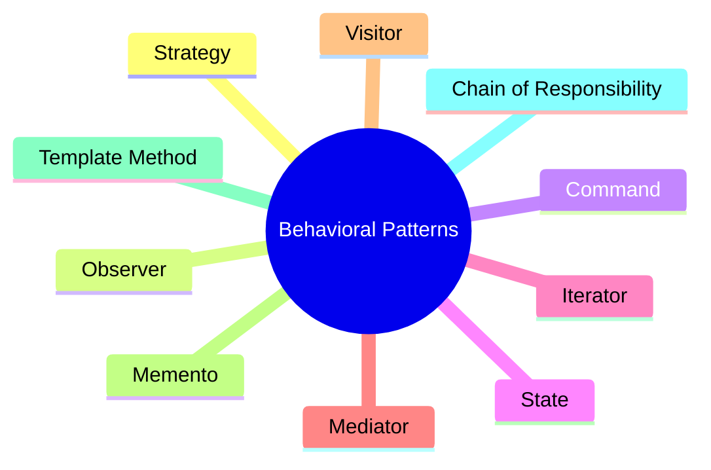

**Behavioral Design Patterns** are a category of design patterns that focus on how objects communicate, interact, and share responsibilities with each other.

While:

* **Creational Patterns** deal with object creation.
* **Structural Patterns** deal with object composition.

**Behavioral Patterns** deal with object behavior and communication.

---

## Why Do We Need Behavioral Patterns?

As software grows larger, objects need to:

* Communicate efficiently.
* Share responsibilities.
* Exchange information.
* Coordinate actions.

Without proper patterns, object interactions become tightly coupled and difficult to maintain.

Behavioral patterns provide proven solutions for managing these interactions.

---

## Real-World Analogy

Imagine a company:

* Employees communicate with managers.
* Managers communicate with departments.
* Departments communicate with executives.

There must be clear communication rules to avoid confusion.

Behavioral patterns provide these communication mechanisms in software systems.

---

## Common Behavioral Design Patterns

| Pattern                 | Purpose                                            |
| ----------------------- | -------------------------------------------------- |
| Strategy                | Change algorithms at runtime                       |
| Observer                | Notify multiple objects about changes              |
| Command                 | Encapsulate requests as objects                    |
| State                   | Change behavior based on internal state            |
| Iterator                | Traverse collections without exposing structure    |
| Mediator                | Centralize communication between objects           |
| Chain of Responsibility | Pass requests through a chain of handlers          |
| Template Method         | Define algorithm structure with customizable steps |
| Visitor                 | Add operations without modifying classes           |
| Memento                 | Save and restore object state                      |

---

## Category Structure



---

## Key Characteristics

* Focus on object communication.
* Reduce coupling between classes.
* Improve flexibility and maintainability.
* Define clear responsibility distribution.
* Encourage reusable behavior.

---

## Memory Tip

```text
Behavioral = How Objects Behave and Communicate
```

Think of Behavioral Patterns as the **communication rules** of a software system.

---

## Quick Revision

### Category

Behavioral Design Pattern

### Focus

Object interaction and communication

### Goal

Manage responsibilities and behavior between objects

### Key Benefit

Loose coupling and flexible communication

### Common Examples

Strategy, Observer, Command, State, Iterator

### One-Line Exam Definition

Behavioral Design Patterns define how objects communicate, interact, and distribute responsibilities within a system.
